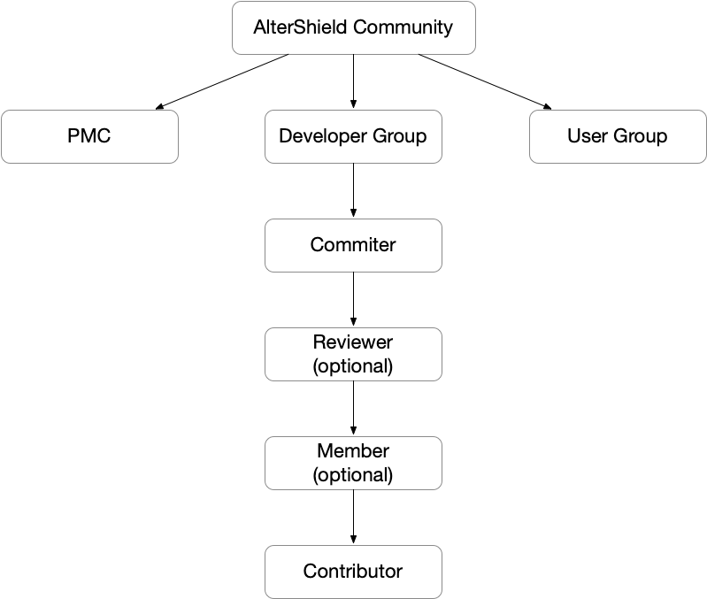

# Join Us
Hello and welcome to the AlterShield open source community. Firstly, we thank you for your interest in AlterShield ❤ 
 
The community is still in its early stages and we welcome all kinds of discussions and corrections. Whether it is correcting typos, translating documents, fixing bugs, discussing change failure cases, or adding new features, please feel free to raise an issue or pull request on the Github community, or join our DingTalk group at 11360043976 to contact us. 
 
Project link: 
- AlterShield：https://github.com/traas-stack/altershield
- AlterShield-Operator：https://github.com/traas-stack/altershield-operator

## Question Guidelines

If you encounter difficulties while reading AlterShield-related documents, blogs, or source code, the community welcomes all students to submit feedback through the Github Issue section. You can write your questions, deidentified change failure cases, or any doubts about AlterShield in the issue. Submitting an issue can help future users, who can find solutions by searching through search engines when they encounter similar issues.

If there is a delay in the response to the issue, you can contact the group administrator in the DingTalk group, who will help to urge the project maintainer to reply to the issue.

## Participating in Open Source Co-building
As an open source community, we welcome various forms of contributions. You can participate in community building in forms including but not limited to:

+ Correcting typos: Help us point out errors in the documents.
+ Discussion of issues and cases: Your company's change failure cases, de-identified, can be discussed to find solutions together.
+ Bug reporting: Help us identify logical errors in AlterShield.
+ Discussion of new feature scenarios: Any change-related functions that AlterShield does not yet have can be discussed together.
+ Improving the OCMS protocol: Currently, the OCMS open source is still in version 0.1. If there are situations in your scenario that cannot be adapted, you can directly participate in discussions and extensions.
+ Improving the Operator ecosystem: Currently, the Operator will be docked with Kubernetes Deployment in version 0.1. You can transform and dock the Operator under your CI/CD tool to extend its ecosystem.
+ Integrating more monitoring tools: You can integrate the monitoring tools you use into the observable defense capability provided by AlterShield to expand the range of detection capabilities.
+ Consolidate your change defense expert experience: You can use Plugin or SPI extensions to consolidate your change defense expert experience into AlterShield.

## AlterShield community organizational structure?

### Developer Group（code/documentation）
#### Contributor

##### How to become a Contributor ?

Successfully submit a pull request (PR) and merge it in any project of AlterShield.

#### Member

Join the AlterShield GitHub organization and become a member of the AlterShield open source community.

##### Conditions to become a Member

You can apply to become a Member if you meet the following conditions:

+ Contributed a valuable pull request (PR)
+ Willing to help maintain the community

##### How to become a Member ?

You can create an issue in any AlterShield community, including:

+ Introduce yourself
+ Post the pull requests you have contributed 

The community maintainers will respond to you promptly.

##### Responsibilities

As a Member, you need to help respond to issues/PRs and triage (assign issues to the responsible person of the corresponding module).

##### Permissions

Triage permission. You have permission to operate on issues and PRs, such as adding labels and assigning issues.

More info: [permissions-for-each-role][permissions-for-each-role]

[permissions-for-each-role]:https://docs.github.com/en/organizations/managing-user-access-to-your-organizations-repositories/repository-roles-for-an-organization#permissions-for-each-role

#### Reviewer （Optional）

Module owners are responsible for issue review and code review for a specific module.

This role is optional. If project leaders feel it is unnecessary, this role can be omitted.

##### Conditions to be a Reviewer

If you are willing to be responsible for issue review and code review for a specific module, and have contributed PRs to that module that meet one of the following conditions:

- 1 Hard-level PR
- 2 Medium-level PRs
- 1 Medium-level PR + 2 Easy-level PRs

Note: The conversion ratio of Hard:Medium:Easy is 1:2:4.

The logic behind this rule is that a Reviewer must have a good understanding of a module in order to review it properly. How can we determine if they have a good understanding? We can look at the PRs they have worked on, specifically 1 Hard-level PR, or 2 Medium-level PRs, or 1 Medium-level PR + 2 Easy-level PRs.

##### Responsibilities of a Reviewer

A Reviewer is responsible for issue review and code review for a specific module, providing technical suggestions. If there are significant changes related to that module, the module's Reviewer will be requested to review them.

#### Committer

##### How to be a Committer ? 

PRs contributed must meet one of the following conditions:

- At least 10 merged PRs, including at least 
- 1 Hard-level PR or 4 Medium-level PRs.

##### Responsibilities
- Provide community consultation and support;
- Actively respond to Issues or PRs assigned to you;
- Voting rights for major community decisions;
- Review community PRs.

##### Permissions
- Pull Request review permission；
- Pull Request approve permission；

##### Certification, Operations, and Promotion

- Issue electronic certificates in the Discussion section.

### PMC

Project Management Committee, the core management team of the project, participating in the formulation of the roadmap and significant decisions related to the community.

#### How to become a PMC ?

A PMC Member nominates a Committer, and then the PMC votes. A majority vote is required to promote a nominee to a PMC Member.

#### Responsibilities

- Actively participate in community discussions and provide guidance on significant community decisions;
- Responsible for ensuring that community activities of the open source project run smoothly.

#### Permissions

- Pull Request review permission;
- Pull Request approve permission;
- Merge permission.