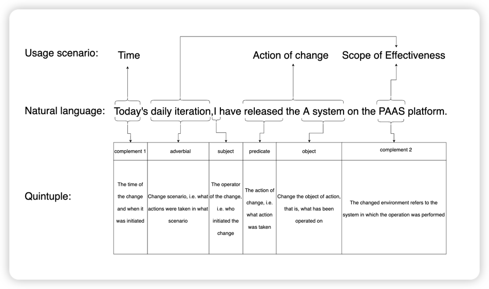
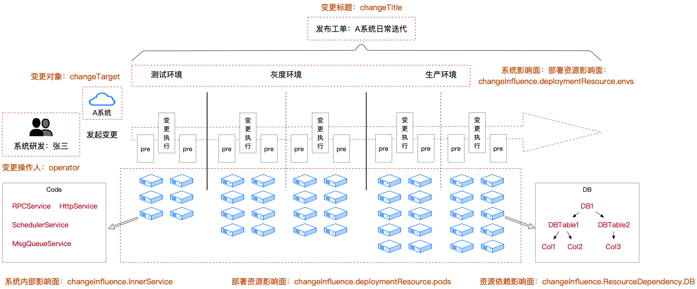

# Change Model

---

## What is a change information model
### Background:
The change control system implements an "information standardization" approach, which can shield the variability of changes brought about by different business scenarios and structure and unify changes in different scenarios. Another benefit is that it can separate "change execution" and "change risk control" into two independent tasks, allowing the change system development team and the technical risk team (SRE/Operations/Quality) to divide their work and reduce communication and duplicate construction costs.
### How to Define Change

---

Before considering how to establish an information model, the first question you need to understand is: how to define change? (For understanding change control systems, please refer to the previous article ["Introduction to Change Control."](./))

You can try to approach this question from two perspectives: usage scenarios and natural language. Based on these two perspectives, the semantic definition of the basic information of changes can be summarized into a five-tuple:




The above is the definition of basic information in the change information model.

### How to define the impact scope of changes in the change information model

---

The impact of a change is not limited to the object of the change itself. In fact, due to the complexity of the business system, a change to a system itself may affect the entire business chain. 
Therefore, it is not enough to infer the scope of the impact of a change only from the definition of basic information in the previous section, for subsequent risk identification and emergency positioning assistance. 

In addition to basic information, a structure is needed to describe the impact scope of a change. 

After referencing numerous 'change actions,' changes can be roughly divided into three categories to describe their impact scope, and a pattern was discovered: 
- Business level changes (e.g. modifying the configuration of certain operational activities): For these types of changes, their implementation is always carried out by a certain system. This system can be a server, front-end, mobile end, or mini program in any form.
- Operations level changes (e.g. releasing the code of a system): For these types of changes, their implementation is directly in a certain system or its associated deployment resources.
- Infrastructure level changes (e.g. deleting a physical machine node): For these types of changes, their implementation may be far from the application system, but the object of the change must be a batch of deployment resources on which some application systems depend. 

Therefore, based on the resources, dependencies, and attributes possessed by application systems, we can deconstruct the change impact information related to the information technology industry. The summary is shown in the following figure:
> TODO a deployment diagram for the application

According to the content shown in the above diagram, the impact scope information of a change can be divided into the following structures:
- Internal system impact scope: Technical 'attributes' possessed by an application system itself, including HTTP services, RPC services, SQL statements accessing funds, and printed log files published within the system.
- Business chain impact scope: Business 'attributes' of an application system, including the definition of the system's business chain, upstream and downstream system relationships, and the estimated number of affected users in business traffic.
- Deployment resource impact scope: Structural relationships of the resources deployed by an application system, including information on the virtual machines, physical machines, and namespaces that the system is deployed on.
- Resource dependency impact scope: Dependency relationships of an application system, including information on the data storage, data calculation, and middleware that the system depends on.


### How to define the implementation method of a change

---

Before understanding the definition of the implementation method of a change, you need to be clear about one thing: If you want to have strict and complete risk control for a change, then it should never be implemented in an online environment as a 'gamble.'

So, what needs to be discussed in this paragraph is how to describe the changes that are implemented gradually in an online environment in a structured way.

In AlterShield, we have defined several common implementation methods for changes, and welcome your additions and corrections:
- Traditional machine batch mode: This is also the most common 'canary release' mode.
- Batch mode based on traffic proportion: Gradual implementation based on traffic proportion, such as 1%, 5%, 10%, etc., commonly used for changes strongly related to business or user interaction. (Example: Upgrading front-end/client systems and activating operation activities, etc.)
- Independent environment verification mode for changes that cannot be batched: For changes that cannot be split (e.g. DB configuration type changes), an independent environment is required for gray verification to validate the correctness of the change.
### JSON Schema



Above are the three dimensions of the standard definition for the change information model, and the specific JSON Schema definitions are as follows:

```json
{
  "$schema": "http://json-schema.org/draft-04/schema#",
  "type": "object",
  "properties": {
    "planStartTime": {
      "type": "string"
    },
    "changeTitle": {
      "type": "string"
    },
    "changeUrl": {
      "type": "string"
    },
    "creator": {
      "type": "string"
    },
    "changeScenarioCode": {
      "type": "string"
    },
    "changePhases": {
      "type": "array",
      "items": [
        {
          "type": "string"
        }
      ]
    },
    "changeContents": {
      "type": "array",
      "items": [
        {
          "type": "object",
          "properties": {
            "contentType": {
              "type": "object",
              "properties": {
                "typeName": {
                  "type": "string"
                }
              },
              "required": [
                "typeName"
              ]
            },
            "instanceName": {
              "type": "string"
            }
          },
          "required": [
            "contentType",
            "instanceName"
          ]
        }
      ]
    },
    "changeParamJson": {
      "type": "string"
    },
    "changeApps": {
      "type": "array",
      "items": [
        {
          "type": "string"
        }
      ]
    },
    "parentOrderInfo": {
      "type": "object",
      "properties": {
        "orderId": {
          "type": "string"
        },
        "orderTitle": {
          "type": "string"
        },
        "orderUrl": {
          "type": "string"
        }
      },
      "required": [
        "orderId",
        "orderTitle",
        "orderUrl"
      ]
    },
    "trace": {
      "type": "object",
      "properties": {
        "traceId": {
          "type": "string"
        },
        "coord": {
          "type": "object",
          "properties": {
            "coord": {
              "type": "string"
            }
          },
          "required": [
            "coord"
          ]
        }
      },
      "required": [
        "traceId",
        "coord"
      ]
    },
    "changeSceneKey": {
      "type": "string"
    },
    "bizExecOrderId": {
      "type": "string"
    },
    "platform": {
      "type": "string"
    }
  },
  "required": [
    "planStartTime",
    "changeTitle",
    "changeUrl",
    "creator",
    "changeScenarioCode",
    "changePhases",
    "changeTargets",
    "changeContents",
    "changeParamJson",
    "changeApps",
    "parentOrderInfo",
    "trace",
    "tenantCode",
    "changeSceneKey",
    "bizExecOrderId",
    "platform"
  ]
}
```