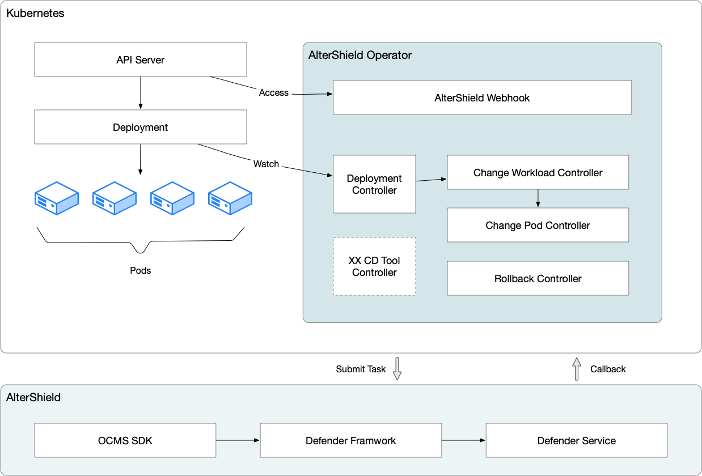

# What is AlterShield Operator
## Overview
AlterShield Operator is a Kubernetes Operator developed based on Operator-SKD. Its purpose is to improve the stability and reliability of Kubernetes clusters by controlling Workload resources. Currently, AlterShield Operator supports controlling Deployment resources, while other common resources are continuously being developed. Its core design goals are rapid development, easy learning, and easy scalability.

## Features
AlterShield Operator has the following main functions:

1. Admission control, controlling the deployment of Workload resources to prevent deployment under abnormal conditions

2. Run detection, monitoring the PODs under Workload resources to ensure the running status of resources

3. Rollback self-healing, automatically rolling back the abnormal state of Workload resources and self-healing the rollback exception 

Through these functions, AlterShield Operator can help users better manage Workload resources in Kubernetes clusters and improve system stability and reliability.


## Source directory introduction
The directory structure of AlterShield Operator's source code is as follows:
```
./apis/
./bin/
./certs/
./config/
./controllers/
./routers/
./main.go
./Makefile
````
- `apis/`：Contains the API for custom CRD (Custom Resource Definition) as well as the struct definitions related to Kubernetes' native API.
- `bin/`：Contains the executable file for AlterShield Operator.
- `certs/`：Contains the certificate files for AlterShield Operator, used for local debugging of Webhook.
- `config/`：Contains the configuration files for AlterShield Operator.
- `controllers/`：Contains the controller code for AlterShield Operator.
- `routers/`：Contains the router code for communication between AlterShield Operator and AlterShield Server.
- `runnable/`：Contains the background task code for AlterShield Operator.
- `main.go`：The entry file for AlterShield Operator.
- `Makefile`：The compilation file for AlterShield Operator.
## Architecture design
### 1. Design target
As a Kubernetes Operator, the main function of AlterShield Operator is to control Workload by listening to CRD in Kubernetes and communicating with AlterShield Server. Specifically, the design goals of AlterShield Operator are as follows:
#### 1.1. Version confirmation and release control
- Use Webhook to confirm the version and release control of Workload in Kubernetes. When a user submits a new version of Workload, AlterShield Operator sends a request through Webhook to confirm the version and release control with AlterShield Server, ensuring that the submitted version complies with security standards and can be deployed correctly to the Kubernetes cluster.
#### 1.2. Real-time monitoring
- Use Watch to monitor Workload and Pod in Kubernetes in real-time. When a change occurs in Workload or Pod in Kubernetes, AlterShield Operator detects and processes it in real-time to ensure that the status of Workload and Pod in the Kubernetes cluster is synchronized with AlterShield Server.
#### 1.3. Release status summary
- Use ChangeWorkload to summarize the release status of Workload in Kubernetes. When a user submits a new version of Workload, AlterShield Operator records its status in ChangeWorkload and periodically sends requests to AlterShield Server to update the release status of Workload. This way, users can easily check the release status and change history of Workload.
#### 1.4. Release status verification
- Use ChangePod and communication with AlterShield Server to verify the release status of Pod in Kubernetes. When a change occurs in Pod in Kubernetes, AlterShield Operator checks its status and verifies its release status through communication with AlterShield Server.
#### 1.5. Configuration update
- Use OpsConfigInfo to update the configuration of Operator. When a user needs to modify the configuration of AlterShield Operator, they can modify the parameters in OpsConfigInfo to achieve the desired effect. AlterShield Operator will detect the changes in parameters in a timely manner and update its configuration accordingly.
### 2. System composition
AlterShield Operator consists of the following components:
- Controller：Responsible for listening to CR and custom CRD in Kubernetes and responding accordingly.
- Webhook：Responsible for version confirmation and release control of Workload in Kubernetes.
- Router：Responsible for callback processing between AlterShield Operator and AlterShield Server.
- Runnable：Responsible for asynchronous background tasks.
### 3. System flow

The architecture diagram of the AlterShield Operator system is as follows:



- 1. The Webhook listens to the Deployment in Kubernetes. If the Template of the Deployment is changed, it updates the Version Label of the Deployment and determines whether to block the release. The Version Label is a label used to mark the version of the Deployment. Whenever the Template of the Deployment is changed, the value of the Version Label will be updated accordingly. This label helps AlterShield Operator to perform version control and management.
- 2. The Deployment Controller listens to the Deployment in Kubernetes and creates a corresponding version of ChangeWorkload. ChangeWorkload is a custom resource type in AlterShield Operator that records the version change history of the Deployment. When the Template of the Deployment is changed, the Deployment Controller creates a new ChangeWorkload to record the information of the new version of the Deployment.
- 3. The Pod Controller listens to the Pod in Kubernetes and determines whether it is a finished Pod. If it is, it adds a Finished Label. The Finished Label is a label used to mark the finished Pod, which helps AlterShield Operator locate the finished Pod and calculate the number of finished Pods.
- 4. The ChangeWorkload Controller listens to the ChangeWorkload and finished Pod in Kubernetes. When the number of finished Pods reaches the threshold, it creates a ChangePod in the Init state. ChangePod is another custom resource type in AlterShield Operator that records the status and callback results of the released Pods. When the number of finished Pods reaches the threshold, the ChangeWorkload Controller creates a ChangePod in the Init state, which will pass the Pod information to the AlterShield Server in the future.
- 5. The ChangePod Controller listens to the ChangePod in Kubernetes. When the status of the ChangePod is Init, it selects no more than the threshold number of Finished Pods and passes the information to the AlterShield Server to achieve the callback function through Router and CallBack Handle. The ChangePod Controller listens to the callback results of the AlterShield Server and updates the status of the ChangePod according to the callback results.
- 6. The ChangePod Controller listens to the ChangePod in Kubernetes. When the status of the ChangePod is Callback Finished, it updates the status of the ChangePod according to the callback results and sets the status of the ChangePod to Done. It then sends this information to the ChangeWorkload Controller.
- 7. The ChangeWorkload Controller listens to the ChangeWorkload and Done ChangePod in Kubernetes. It updates the status of the ChangeWorkload according to the status of the ChangePod and determines whether to block the release. If the status of all the Pods in the ChangePod passes the verification, the ChangeWorkload Controller will update the status of the ChangeWorkload to Success. Otherwise, it will update it to Suspend.
- 8. The Rollback Runnable checks the Pod in Kubernetes. If a Pod has not reached the Running state for a long time (default 2 minutes), it triggers the Rollback mechanism. Rollback Runnable is a background task in AlterShield Operator used to check the status of Pods. If a Pod has been in a non Running state for a long time, it triggers an automatic rollback operation to ensure the stability of the Kubernetes cluster.
- 9. The Rollback Runnable listens to the ChangeWorkload in Kubernetes. When the status of the ChangeWorkload is Rollback, it triggers the Rollback mechanism. The Rollback Runnable also listens to the status of the ChangeWorkload. If the status of the ChangeWorkload is Rollback, it triggers an automatic rollback operation to ensure the stability of the Kubernetes cluster. (Under construction)
