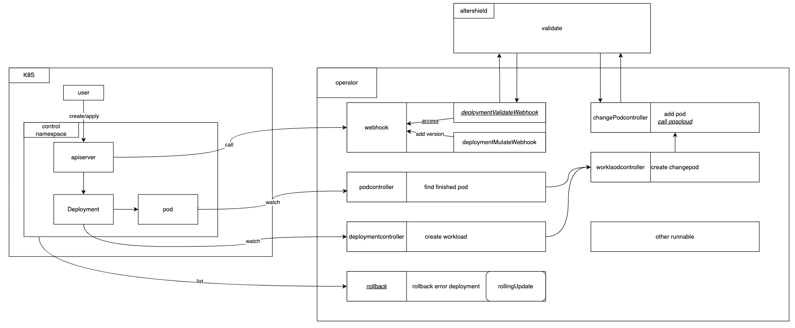

# User Guide
本文档介绍了 AlterShield Operator 的使用指南。

## Getting Started
##### 您在运行 AlterShield Operator 高级功能之前，需要阅读以下文档：
- [Quick Deploy](./quick-deploy) 并且 Running on the cluster
##### 您在使用 AlterShield Operator 高级功能之前，需要了解以下概念：
- [CustomResourceDefinition](https://kubernetes.io/docs/reference/kubernetes-api/extend-resources/custom-resource-definition-v1/)
- [Webhook Mode](https://kubernetes.io/docs/reference/access-authn-authz/webhook/)

## AlterShield Operator 基本原理

- 如图所示，AlterShield Operator中基于Kubernetes的Webhook机制与Watch机制实现了对Kubernetes资源的监控。
- 定义两个全新的CRD资源：ChangeWorkload与ChangePod，用于定义对Workload资源与Pod资源的监测信息。
- 当集群中的Deployment资源发生变化时，AlterShield Operator对变化的资源进行检测，如果检测到异常，则会对异常资源未来变更拦截，同时触发自愈回滚。
#### 接下来，尝试进一步使用 AlterShield Operator
## 1. 创建一个Deployment资源 sleep
```yaml
apiVersion: apps/v1
kind: Deployment
metadata:
  name: sleep
  labels:
    app: sleep
spec:
  replicas: 5
  selector:
    matchLabels:
      app: sleep
  template:
    metadata:
      labels:
        app: sleep
        test: "123"
    spec:
      containers:
      - name: sleep
        image: busybox
        command: ["/bin/sleep","infinity"]
        imagePullPolicy: IfNotPresent
```
- 执行命令
```sh
kubectl apply -f config/samples/sleep.yaml
```
- 当您看到以下日志时，表示完成部署
```
deployment.apps/sleep created
```
## 2. 检测是否部署成功
- 执行命令
```sh
kubectl get pods
```
- 当您看到有5个sleep的pod running时，表示部署成功
```
NAME                     READY   STATUS    RESTARTS   AGE
sleep-5c698f4449-8q79v   1/1     Running   0          2m
sleep-5c698f4449-fsb27   1/1     Running   0          2m
sleep-5c698f4449-gttrk   1/1     Running   0          2m
sleep-5c698f4449-mllt2   1/1     Running   0          2m
sleep-5c698f4449-qv24p   1/1     Running   0          2m
```
## 3. 观察集群中Deployment sleep的yaml
- 执行命令
```sh
kubectl get deployment sleep -o yaml
```
- 与[Quick-Start](./quick-start)中Running Local Sever不同，您会发现在集群中的deployment sleep的yaml中多了两个Label
```yaml
apiVersion: v1
items:
- apiVersion: apps/v1
  kind: Deployment
  metadata:
    annotations:
      deployment.kubernetes.io/revision: "6"
      kubectl.kubernetes.io/last-applied-configuration: ...(此处省略)
    creationTimestamp: ...(此处省略)
    generation: 6
    labels:
      admission-webhook-altershield.antgroup.com/version: c6c45d23c098bdf181853a85b60b5d74
      altershield.defense.antgroup.com/defense-status: processed
      app: sleep
    name: sleep
    namespace: default
    resourceVersion: "196532"
    uid: 63e253a2-d18a-4100-b928-38e004263762
  spec:
    progressDeadlineSeconds: 600
    replicas: 5
    revisionHistoryLimit: 10
    selector:
      matchLabels:
        app: sleep
    strategy:
      rollingUpdate:
        maxSurge: 25%
        maxUnavailable: 25%
      type: RollingUpdate
    template:
      metadata:
        creationTimestamp: null
        labels:
          admission-webhook-altershield.antgroup.com/version: c6c45d23c098bdf181853a85b60b5d74
          app: sleep
          test: "123"
      spec: ...(此处省略)
  status:
    availableReplicas: 5
    conditions:
    - lastTransitionTime: ...(此处省略)
    - lastTransitionTime: ...(此处省略)
    readyReplicas: 5
    replicas: 5
    updatedReplicas: 5
kind: List
metadata:
  resourceVersion: ""
```
- 发现在deployment的metadata.labels中多了一个`admission-webhook-altershield.antgroup.com/version`
- 发现在deployment的spec.template.metadata.labels中多了一个`admission-webhook-altershield.antgroup.com/version`

这是AlterShield Operator为deployment所添加，用于标识您的deployment经过AlterShield Operator处理并依据template生成版本号。
## 4. 观察集群中ChangeWorkload CR资源
- 执行命令
```sh
kubectl get changeworkload -o yaml
```
```yaml
apiVersion: v1
items:
- apiVersion: app.ops.cloud.alipay.com/v1alpha1
  kind: ChangeWorkload
  metadata:
    creationTimestamp: "2023-05-11T07:24:12Z"
    generation: 1
    labels:
      admission-webhook-altershield.antgroup.com/version: c6c45d23c098bdf181853a85b60b5d74
      app.kubernetes.io/deployment-name: sleep
    name: sleep--x--c6c45d23c098bdf181853a85b60b5d74
    namespace: default
    ownerReferences:
    - apiVersion: apps/v1
      blockOwnerDeletion: true
      controller: true
      kind: Deployment
      name: sleep
      uid: 57719e7d-fcae-4667-8e93-217184afe5a3
    resourceVersion: "197374"
    uid: 2405c4f9-e811-400c-a104-283cee03a2d8
  spec:
    appName: sleep
    changeWorkloadId: sleep--x--c6c45d23c098bdf181853a85b60b5d74
    countThreshold: 1
    createTime: "2023-05-11 07:24:12"
    createTimeUnix: 1683789852
    reversion: c6c45d23c098bdf181853a85b60b5d74
    serviceName: sleep
    waitTimeThreshold: 60
kind: List
metadata:
  resourceVersion: ""
```
- 发现AlterShield Operator为deployment sleep的 **c6c45d23c098bdf181853a85b60b5d74** 版本创建了一个 **ChangeWorkload** 资源 **sleep--x--c6c45d23c098bdf181853a85b60b5d74**
## 5. 等待AlterShield Operator完成运行检测
#### 运行检测详情请参考[Open Change Management Specification](../open-change-management-specification/overview)
#### 当运行检测完成后，您会发现 **ChangeWorkload** 资源的 **status** 字段中多了一些内容
- 执行命令
```sh
kubectl get changeworkload -o yaml
```
- 观察输出
```yaml
apiVersion: v1
items:
  - apiVersion: app.ops.cloud.alipay.com/v1alpha1
    kind: ChangeWorkload
    metadata: ...(此处省略)
    spec: ...(此处省略)
    status:
      defenseCheckPassPods:
        - app: sleep
          hostName: sleep-5c698f4449-fsb27
          ip: 10.244.1.198
          namespace: default
          pod: sleep-5c698f4449-fsb27
          workSpace: default
        - app: sleep
          hostName: sleep-5c698f4449-gttrk
          ip: 10.244.1.201
          namespace: default
          pod: sleep-5c698f4449-gttrk
          workSpace: default
        - app: sleep
          hostName: sleep-5c698f4449-8q79v
          ip: 10.244.1.202
          namespace: default
          pod: sleep-5c698f4449-8q79v
          workSpace: default
        - app: sleep
          hostName: sleep-5c698f4449-mllt2
          ip: 10.244.1.199
          namespace: default
          pod: sleep-5c698f4449-mllt2
          workSpace: default
        - app: sleep
          hostName: sleep-5c698f4449-qv24p
          ip: 10.244.1.200
          namespace: default
          pod: sleep-5c698f4449-qv24p
          workSpace: default
      entryTime: "2023-05-11 15:46:15"
      entryTimeUnix: 1683791175
      status: Success
      updateTime: "2023-05-11 15:46:19"
      updateTimeUnix: 1683791179
kind: List
metadata:
  resourceVersion: ""
```
- defenseCheckPassPods: 代表已经完成了运行检测并且通过AlterShield Operator检测的Pod列表
- 当defenseCheckPassPods中的Pod数量达到deployment的replicas数量时，AlterShield Operator会将 **ChangeWorkload** 资源的 **status** 字段设置为 **Success**，表示当前版本已经成功发布
## 6. 观察集群中ChangePod CR资源
- 执行命令
```sh
kubectl get changepods | grep sleep
```
- 观察输出
```
NAME                                               STATUS        MESSAGE     CREATETIME
sleep--x--c6c45d23c098bdf181853a85b60b5d74--x--1   ExecuteDone   PreFailed   2023-05-11 15:46:13
sleep--x--c6c45d23c098bdf181853a85b60b5d74--x--2   ExecuteDone   PreFailed   2023-05-11 15:46:14
sleep--x--c6c45d23c098bdf181853a85b60b5d74--x--3   ExecuteDone   PreFailed   2023-05-11 15:46:14
sleep--x--c6c45d23c098bdf181853a85b60b5d74--x--4   ExecuteDone   PreFailed   2023-05-11 15:46:15
sleep--x--c6c45d23c098bdf181853a85b60b5d74--x--5   ExecuteDone   PreFailed   2023-05-11 15:46:15
```
- AlterShield Operator为deployment sleep的 **c6c45d23c098bdf181853a85b60b5d74** 版本创建了5个 **ChangePod** 资源
- 默认情况下，AlterShield Operator会为每个deployment的每个Pod创建一个 **ChangePod** 资源
- ChangePod资源的名称格式为 **{deployment名称}--x--{版本号}--x--{序号}**
- ChangePod资源的 **status** 字段为 **ExecuteDone** 代表已经完成了运行检测
- ChangePod资源的 **message** 字段为 **PreFailed** 代表执行检测失败（需完成配置[Open Change Management Specification](../open-change-management-specification/overview)）
- 执行失败并不会认为是发布失败，只有检测时发现Pod异常才会认为是发布失败
#### 当前场景中，ChangePod都是执行失败，未发现异常；在ChangeWorkload中认为发布成功的原因是认为所有Pod都通过了检测
## 7. 发布阻断与修复
### 修改changePod状态，模拟异常情况
#### 当未配置接入Change Management时，暂时只能手动模拟异常情况
- 执行命令
```sh
kubectl get changepods sleep--x--c6c45d23c098bdf181853a85b60b5d74--x--1 -o yaml
```
- 观察输出
```yaml
apiVersion: app.ops.cloud.alipay.com/v1alpha1
kind: ChangePod
metadata:
  creationTimestamp: "2023-05-11T07:46:13Z"
  generation: 2
  labels:
    admission-webhook-altershield.antgroup.com/version: c6c45d23c098bdf181853a85b60b5d74
    app.kubernetes.io/deployment-name: sleep
  name: sleep--x--c6c45d23c098bdf181853a85b60b5d74--x--1
  namespace: default
  ownerReferences:
  - apiVersion: app.ops.cloud.alipay.com/v1alpha1
    blockOwnerDeletion: true
    controller: true
    kind: ChangeWorkload
    name: sleep--x--c6c45d23c098bdf181853a85b60b5d74
    uid: a9b8b77c-ebaa-48d7-915f-bb8c02f5ce91
  resourceVersion: "199426"
  uid: 09907f64-4eb8-47da-b46d-5ac0427ebf80
spec:
  changeWorkloadId: sleep--x--c6c45d23c098bdf181853a85b60b5d74
  createTime: "2023-05-11 15:46:13"
  createTimeUnix: 1683791173
  podInfos:
  - app: sleep
    hostName: sleep-5c698f4449-fsb27
    ip: 10.244.1.198
    namespace: default
    pod: sleep-5c698f4449-fsb27
    workSpace: default
status:
  message: PreFailed
  status: ExecuteDone
  updateTime: "2023-05-11 15:46:17"
  updateTimeUnix: 1683791177
```
- 获取.spec.podInfos字段并修改status内容
```sh
kubectl patch changepod --subresource=status sleep--x--c6c45d23c098bdf181853a85b60b5d74--x--1 -p '{"status":{"podResults":[{"app":"sleep","hostName":"sleep-5c698f4449-fsb27","ip":"10.244.1.198","namespace":"default","pod":"sleep-5c698f4449-fsb27","workSpace":"default","verdict":"unpass","message":"find error"}], "message": "PostFinish"}}' --type merge
```
- 重新观察ChangePod与ChangeWorkload资源
```sh
kubectl get changepods
kubectl get changeworkloads
kubectl get changeworkloads -o yaml
kubectl get deployment sleep -o yaml
```
```
NAME                                               STATUS        MESSAGE      CREATETIME
sleep--x--c6c45d23c098bdf181853a85b60b5d74--x--1   ExecuteDone   PostFinish   2023-05-11 15:46:13
sleep--x--c6c45d23c098bdf181853a85b60b5d74--x--2   ExecuteDone   PreFailed    2023-05-11 15:46:14
sleep--x--c6c45d23c098bdf181853a85b60b5d74--x--3   ExecuteDone   PreFailed    2023-05-11 15:46:14
sleep--x--c6c45d23c098bdf181853a85b60b5d74--x--4   ExecuteDone   PreFailed    2023-05-11 15:46:15
sleep--x--c6c45d23c098bdf181853a85b60b5d74--x--5   ExecuteDone   PreFailed    2023-05-11 15:46:15
---
NAME                                         STATUS    CREATETIME
sleep--x--c6c45d23c098bdf181853a85b60b5d74   Suspend   2023-05-11 15:46:12
---
apiVersion: v1
items:
- apiVersion: app.ops.cloud.alipay.com/v1alpha1
  kind: ChangeWorkload
  metadata: ...(略)
  spec: ...(略)
  status:
    ...(略)
    defenseCheckFailPods:
    - app: sleep
      hostName: sleep-5c698f4449-fsb27
      ip: 10.244.1.198
      message: find error
      namespace: default
      pod: sleep-5c698f4449-fsb27
      verdict: unpass
      workSpace: default
kind: List
metadata:
  resourceVersion: ""
---
apiVersion: apps/v1
kind: Deployment
metadata:
  ...(略)
  labels:
    admission-webhook-altershield.antgroup.com/version: c6c45d23c098bdf181853a85b60b5d74
    altershield.defense.antgroup.com/defense-status: processed
    altershield.defense.antgroup.com/suspend: "1683791175"
    app: sleep
  name: sleep
  namespace: default
spec: ...(略)
status: ...(略)
```
- ChangePod资源的 **status** 字段为 **ExecuteDone** 代表已经完成了运行检测
- ChangePod资源的 **message** 字段为 **PostFinish** 代表执行检测成功
- ChangeWorkload资源的 **status** 字段为 **Suspend** 代表发布发现异常，已经暂停后续发布
- ChangeWorkload资源的 **status.defenseCheckFailPods** 中包含了所有检测失败的Pod信息
- Deployment资源的 **labels.altershield.defense.antgroup.com/suspend** 字段为 **1683791175** 代表暂停发布的时间戳
### 修改Deployment资源，模拟正常发布
- 执行命令
```sh
kubectl patch deployment sleep -p '{"spec":{"template":{"metadata":{"labels":{"test":"test"}}}}}' --type merge
```
- 将会触发Webhook的拦截
```
Error from server (deployment sleep is suspended): admission webhook "vdeployment.kb.io" denied the request: deployment sleep is suspended
```
- 此时发布已经被暂停，需要进行修复后才能继续正常发布
### 修改Deployment资源，模拟修复发布
```yaml
apiVersion: apps/v1
kind: Deployment
metadata:
  name: sleep
  labels:
    app: sleep
    altershield.defense.antgroup.com/ignored-suspend: "true"
spec:
  replicas: 5
  selector:
    matchLabels:
      app: sleep
  template:
    metadata:
      labels:
        app: sleep
        test: "1234"
    spec:
      containers:
        - name: sleep
          image: busybox
          command: ["/bin/sleep","infinity"]
          imagePullPolicy: IfNotPresent
```
- 执行命令
```sh
kubectl apply -f ./config/samples/sleep.yaml
```
- 命令执行成功
```
deployment.apps/sleep configured
```
- 修复sleep Deployment资源，需添加 **altershield.defense.antgroup.com/ignored-suspend** 字段
- 将会忽略拦截功能，进入发布流程
### 查看ChangeWorkload资源
- 执行命令
```sh
kubectl get changeworkloads
```
- 此时同时存在两个版本的ChangeWorkload资源
```
NAME                                         STATUS    CREATETIME
sleep--x--6a8ff823a5011291b0f02a1d83c2222d   Running   2023-05-12 14:24:12
sleep--x--c6c45d23c098bdf181853a85b60b5d74   Suspend   2023-05-12 11:02:28
```
- 等待一段时间后，执行命令
```sh
kubectl get changeworkloads
```
- 此时只存在一个最新Success版本的ChangeWorkload资源
```
NAME                                         STATUS    CREATETIME
sleep--x--6a8ff823a5011291b0f02a1d83c2222d   Success   2023-05-12 14:24:12
```
- 再次修改Deployment资源，模拟正常发布
```sh
kubectl patch deployment sleep -p '{"spec":{"template":{"metadata":{"labels":{"test":"test"}}}}}' --type merge
```
- 发现正常发布成功
```
deployment.apps/sleep patched
```
## 8. Self-healing rollback
### Deployment未能正常发布
- 见Quick Start中文档 [self-healing-rollback](./quick-start#self-healing-rollback) 
#### 触发当前自愈回滚功能前提条件
- 1. 发布过程中，Pod未能正常启动**（未达到Running状态）**超过阈值时间（默认2分钟）
- 2. Deployment资源的发布策略为默认状态 **RollingUpdate** 不能为 **Recreate**
- 3. 当前Deployment处于同时存在两个ReplicaSet的运行，且旧版本的ReplicaSet处于 **正常** 状态
- 4. 当达到阈值时间后，会认为当前发布失败，触发自愈回滚功能，将会回滚到旧版本的ReplicaSet
### Deployment正常发布（建设中）
- 见场景 [7-发布阻断与修复](./user-guide#7-发布阻断与修复)
#### 触发当前自愈回滚功能说明
- 1. 发布过程中，Pod正常启动**（达到Running状态）**，Deployment资源发布成功
- 2. Deployment资源的发布策略 **不做限制**
- 3. Deployment历史版本中存在成功发布的版本**（ChangeWorkload为Success）**
- 4. ChangePod资源与AlterShield中发现其中存在检测**未通过**的Pod信息
- 5. 当前版本的ChangeWorkload资源处于 **Suspend** 状态，会认为当前发布异常，触发自愈回滚功能
- 6. 将会回滚到历史版本中最新的成功发布的版本
#### 待定的相关说明
- 1. 触发时机：见文档 [异常Deployment的正常发布](./user-guide#修改deployment资源模拟正常发布)，当发现异常时会阻止正常的发布并放行修复性的发布，所以会将以接口的形式暴露出来，供用户手动触发
- 2. 历史版本：目前主要是采用Deployment的ReplicaSet的版本来进行判断，但是这个版本只能保留部分，未必能够满足用户的需求，所以会考虑增加历史版本的功能，可以自定义保留的版本数量