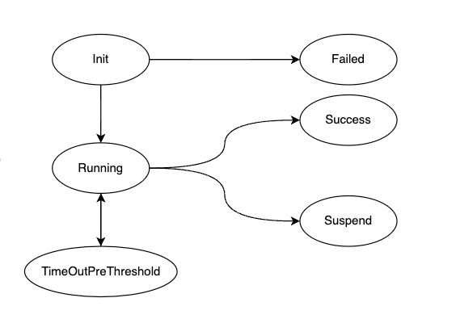

# Advanced Usage
This document introduces the advanced features of AlterShield Operator.

## 1. CRD in AlterShield Operator
**Currently, there are three CRDs defined in AlterShield Operator:**
  - opsconfiginfoes.app.ops.cloud.alipay.com (referred to as oopsconfiginfoes)
  - changeworkloads.app.ops.cloud.alipay.com (referred to as ochangeworkloads)
  - changepods.app.ops.cloud.alipay.com (referred to as ochangepods)

**The YAML files are saved in the config/crd/bases directory.**
### 1.1 opsconfiginfoes
**opsconfiginfoes is used to configure the configuration information of AlterShield Operator.**
- Run the following command to view opsconfiginfoes:
````sh
kubectl get opsconfiginfo -n altershieldoperator-system
````
- There are two configuration information, which are:
````
NAME       AGE
blocking   25h
branch     25h
````
#### 1.1.1 Blocking Configuration
**When AlterShield detects abnormalities in a pod, AlterShield Operator will block the pod according to the blocking configuration information.**
- Run the following command to view the blocking configuration information:
````sh
kubectl get opsconfiginfo blocking -n altershieldoperator-system -o yaml
````
- The content of the blocking configuration information is as follows:
```
apiVersion: app.ops.cloud.alipay.com/v1alpha1
kind: OpsConfigInfo
metadata:
  creationTimestamp: "2023-05-11T07:29:49Z"
  generation: 1
  name: blocking
  namespace: altershieldoperator-system
  resourceVersion: "197897"
  uid: 213514db-33d0-4289-8d56-e3dea227e9c1
spec:
  enable: true
  remark: Enabling Blockade
  type: isBlockingUp
```
- .spec.type is isBlockingUp, indicating whether blocking is enabled
- .spec.enable is true, indicating that blocking is **enabled** (default configuration).
##### Note
- You can manually set .spec.enable to false to disable blocking.
- When .spec.enable is false, if an exception occurs, the deployment will be released normally without blocking.
- If a deployment has been blocked, it will not be released normally when .spec.enable is false.
#### 1.1.2 Batch Control Configuration
**ChangePod will report pod information to AlterShield. This configuration determines whether to enable batch control. When it is turned off, there will be only one pod's information in each ChangePod. When it is turned on, there will be multiple pods' information in each ChangePod (under construction).**
- Run the following command to view the branch configuration information:
````sh
kubectl get opsconfiginfo branch -n altershieldoperator-system -o yaml
````
- The content of the branch configuration information is as follows:
````
apiVersion: app.ops.cloud.alipay.com/v1alpha1
kind: OpsConfigInfo
metadata:
  creationTimestamp: "2023-05-11T07:29:50Z"
  generation: 1
  name: branch
  namespace: altershieldoperator-system
  resourceVersion: "197898"
  uid: 2d18dc78-f65f-484c-8f7b-ea5e87c83fe2
spec:
  content: "10"
  enable: false
  remark: Enabling Batch Protection
  type: isBranch
````
- .spec.type is isBranch, indicating whether batch control is enabled.
- .spec.enable is false, indicating that batch control is **disabled** (default configuration).
- .spec.content is 10, indicating that the threshold for batch control is 10.
##### Note
- .spec.enable cannot be manually set to true at present.
### 1.2 changeworkloads
**changeworkloads maps the changing workloads in the cluster, currently supporting Deployment.**



**The changeworkload has the following states:**
- Init：Initialization state. When a new controlled workload is created, it enters this state.
- - When in this state, if the upload to AlterShield is successful (default), it will enter the Running state.
- - When in this state, if the upload to AlterShield fails (under construction), it will enter the Failed state.
- Running：Running state.
- - When in this state, if the number of Finished pods reaches the threshold (not enabled by default, the number is 1), a ChangePod will be created.
- Failed：Failed state.
- - It will not check the current version until the version changes. The new changeworkload will re-enter the Init state.
- TimeOutPreThreshold：Timeout status before threshold.
- - When the [Batch Control Configuration](./advanced-usage#112-batch-control-configuration) of AlterShield Operator is FALSE，
    if the workload is in the Running state and the number of Finished pods has not reached 1 before reaching the threshold time (default 1 minute), it will enter this status.
- - When the [Batch Control Configuration](./advanced-usage#112-batch-control-configuration) of AlterShield Operator is TRUE,
    if the workload is in the Running state and the number of Finished pods has not reached the configured number (default 10) before reaching the threshold time (default 1 minute), it will enter this status.
- Success：Success status.
- - When all pods are in the Finished state and all pods pass the AlterShield detection, it will enter this status.
- - When unable to report to AlterShield during protection, it will also be considered pass, and only when explicitly returned as abnormal will it enter the fail state.
- - When there is a successful changeworkload, the historical versions of the changeworkload resources will be deleted.
- Suspend：Suspended status.
- - When all pods are in the Finished state and there is a pod that does not pass the AlterShield detection, it will enter this status.
- - When changeworkload is in the Suspend state, it will block the normal deployment of the subsequent Workload resources, and this can be turned off by modifying the [Blocking Configuration](./advanced-usage#111-blocking-configuration)
### 1.3 changepods
**changepods is a mapping of the changing pods in the cluster, with at least one pod corresponding to a changepod.**
## 2. Blocking and Repairing Releases
### Modifying the changePod Status to Simulate an Exceptional Case
#### When AlterShield is not configured, exceptional cases can only be manually simulated.
- Run the command
```sh
kubectl get changepods sleep--x--c6c45d23c098bdf181853a85b60b5d74--x--1 -o yaml
```
- Observe the output
```yaml
apiVersion: app.ops.cloud.alipay.com/v1alpha1
kind: ChangePod
metadata:
  creationTimestamp: "2023-05-11T07:46:13Z"
  generation: 2
  labels:
    admission-webhook-altershield.antgroup.com/version: c6c45d23c098bdf181853a85b60b5d74
    app.kubernetes.io/deployment-name: sleep
  name: sleep--x--c6c45d23c098bdf181853a85b60b5d74--x--1
  namespace: default
  ownerReferences:
  - apiVersion: app.ops.cloud.alipay.com/v1alpha1
    blockOwnerDeletion: true
    controller: true
    kind: ChangeWorkload
    name: sleep--x--c6c45d23c098bdf181853a85b60b5d74
    uid: a9b8b77c-ebaa-48d7-915f-bb8c02f5ce91
  resourceVersion: "199426"
  uid: 09907f64-4eb8-47da-b46d-5ac0427ebf80
spec:
  changeWorkloadId: sleep--x--c6c45d23c098bdf181853a85b60b5d74
  createTime: "2023-05-11 15:46:13"
  createTimeUnix: 1683791173
  podInfos:
  - app: sleep
    hostName: sleep-5c698f4449-fsb27
    ip: 10.244.1.198
    namespace: default
    pod: sleep-5c698f4449-fsb27
    workSpace: default
status:
  message: PreFailed
  status: ExecuteDone
  updateTime: "2023-05-11 15:46:17"
  updateTimeUnix: 1683791177
```
- Retrieve the .spec.podInfos field and modify the status content
```sh
kubectl patch changepod --subresource=status sleep--x--c6c45d23c098bdf181853a85b60b5d74--x--1 -p '{"status":{"podResults":[{"app":"sleep","hostName":"sleep-5c698f4449-fsb27","ip":"10.244.1.198","namespace":"default","pod":"sleep-5c698f4449-fsb27","workSpace":"default","verdict":"unpass","message":"find error"}], "message": "PostFinish"}}' --type merge
```
- Re-observe the ChangePod and ChangeWorkload resources
```sh
kubectl get changepods
kubectl get changeworkloads
kubectl get changeworkloads -o yaml
kubectl get deployment sleep -o yaml
```
```
NAME                                               STATUS        MESSAGE      CREATETIME
sleep--x--c6c45d23c098bdf181853a85b60b5d74--x--1   ExecuteDone   PostFinish   2023-05-11 15:46:13
sleep--x--c6c45d23c098bdf181853a85b60b5d74--x--2   ExecuteDone   PreFailed    2023-05-11 15:46:14
sleep--x--c6c45d23c098bdf181853a85b60b5d74--x--3   ExecuteDone   PreFailed    2023-05-11 15:46:14
sleep--x--c6c45d23c098bdf181853a85b60b5d74--x--4   ExecuteDone   PreFailed    2023-05-11 15:46:15
sleep--x--c6c45d23c098bdf181853a85b60b5d74--x--5   ExecuteDone   PreFailed    2023-05-11 15:46:15
---
NAME                                         STATUS    CREATETIME
sleep--x--c6c45d23c098bdf181853a85b60b5d74   Suspend   2023-05-11 15:46:12
---
apiVersion: v1
items:
- apiVersion: app.ops.cloud.alipay.com/v1alpha1
  kind: ChangeWorkload
  metadata: ...
  spec: ...
  status:
    ...
    defenseCheckFailPods:
    - app: sleep
      hostName: sleep-5c698f4449-fsb27
      ip: 10.244.1.198
      message: find error
      namespace: default
      pod: sleep-5c698f4449-fsb27
      verdict: unpass
      workSpace: default
kind: List
metadata:
  resourceVersion: ""
---
apiVersion: apps/v1
kind: Deployment
metadata:
  ...
  labels:
    admission-webhook-altershield.antgroup.com/version: c6c45d23c098bdf181853a85b60b5d74
    altershield.defense.antgroup.com/defense-status: processed
    altershield.defense.antgroup.com/suspend: "1683791175"
    app: sleep
  name: sleep
  namespace: default
spec: ...
status: ...
```
- The **status** field of the ChangePod resource being **ExecuteDone** means that the run check has been completed.
- The **message** field of the ChangePod resource being **PostFinish** means that the check was successful.
- The **status** field of the ChangeWorkload resource being **Suspend** means that an exception was detected during the release and subsequent releases have been suspended.
- The **status.defenseCheckFailPods** field of the ChangeWorkload resource contains information about all the pods that failed the check.
- The **labels.altershield.defense.antgroup.com/suspend** field of the Deployment resource being **1683791175** means that the release was suspended at that timestamp.
### Modifying the Deployment Resource to Simulate a Normal Release
- Run the command
```sh
kubectl patch deployment sleep -p '{"spec":{"template":{"metadata":{"labels":{"test":"test"}}}}}' --type merge
```
- This will trigger the Webhook interception.
```
Error from server (deployment sleep is suspended): admission webhook "vdeployment.kb.io" denied the request: deployment sleep is suspended
```
- **At this point, the release has been suspended and needs to be repaired before normal releases can continue.**
### Modifying the Deployment Resource to Simulate a Repair Release
```yaml
apiVersion: apps/v1
kind: Deployment
metadata:
  name: sleep
  labels:
    app: sleep
    altershield.defense.antgroup.com/ignored-suspend: "true"
spec:
  replicas: 5
  selector:
    matchLabels:
      app: sleep
  template:
    metadata:
      labels:
        app: sleep
        test: "1234"
    spec:
      containers:
        - name: sleep
          image: busybox
          command: ["/bin/sleep","infinity"]
          imagePullPolicy: IfNotPresent
```
- Run the command
```sh
kubectl apply -f ./config/samples/sleep.yaml
```
- The command executes successfully.
```
deployment.apps/sleep configured
```
- Repair the sleep Deployment resource by adding the **altershield.defense.antgroup.com/ignored-suspend** field.
- The interception function will be ignored and the release will enter the release process.
### View the ChangeWorkload Resource
- Run the command
```sh
kubectl get changeworkloads
```
- At this point, two versions of the ChangeWorkload resource exist simultaneously.
```
NAME                                         STATUS    CREATETIME
sleep--x--6a8ff823a5011291b0f02a1d83c2222d   Running   2023-05-12 14:24:12
sleep--x--c6c45d23c098bdf181853a85b60b5d74   Suspend   2023-05-12 11:02:28
```
- After waiting for some time, run the command again.
```sh
kubectl get changeworkloads
```
- At this point, only the latest Success version of the ChangeWorkload resource exists.
```
NAME                                         STATUS    CREATETIME
sleep--x--6a8ff823a5011291b0f02a1d83c2222d   Success   2023-05-12 14:24:12
```
- Modify the Deployment resource again to simulate a normal release.
```sh
kubectl patch deployment sleep -p '{"spec":{"template":{"metadata":{"labels":{"test":"test"}}}}}' --type merge
```
- The normal release is successful.
```
deployment.apps/sleep patched
```
## 3. Self-healing rollback
### Deployment fails to be deployed successfully.
- Refer to the [self-healing-rollback](./quick-start#self-healing-rollback) section in the Quick Start documentation for more information.
#### Prerequisites for triggering the current self-healing rollback feature:
- 1. During the deployment process, if a Pod fails to start **(does not reach the Running state)** for more than the threshold time (default is 2 minutes).
- 2. The deployment resource is in the default **RollingUpdate** deployment strategy and cannot be **Recreate**.
- 3. The current deployment has two running ReplicaSets simultaneously, and the old version of the ReplicaSet is in the **normal** state.
- 4. Once the threshold time is reached, the current deployment is considered a failure, and the self-healing rollback feature is triggered. It will roll back to the old version of the ReplicaSet.
### Deployment successful deployment (under construction).
- Refer to the scenario [2-blocking-and-repairing-releases](./advanced-usage#2-blocking-and-repairing-releases)
#### Description of the current self-healing rollback feature:
- 1. During the deployment process, if a Pod starts normally **(reaches the Running state)** and the deployment resource is successfully deployed.
- 2. There are **no restrictions** on the deployment strategy of the deployment resource.
- 3. There is a successful version in the deployment history **(ChangeWorkload is Success)**.
- 4. If there is any Pod information in the ChangePod resource and AlterShield that **fails** to pass the check.
- 5. If the current version of the ChangeWorkload resource is in **Suspend** state, it is considered an abnormal deployment, and the self-healing rollback feature is triggered.
- 6. It will roll back to the latest successfully deployed version in the deployment history.
#### Pending related instructions:
- 1. Trigger timing：Please refer to the documentation [Modifying the Deployment Resource to Simulate a Normal Release](./advanced-usage#modifying-the-deployment-resource-to-simulate-a-repair-release)，When an abnormal deployment is detected, normal deployment will be prevented, and reparative deployment will be allowed. Therefore, it will be exposed as an interface for users to trigger manually.
- 2. Deployment history：Currently, the version of ReplicaSet in Deployment is mainly used for judgment, but this version can only be partially retained and may not meet the needs of users. Therefore, we will consider adding the functionality of customizing the number of versions to be retained.

