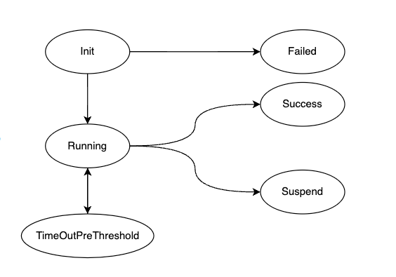

# Advanced Usage
本文档介绍了 AlterShield Operator 的高级功能。

## 1. AlterShield Operator 中 CRD 的使用
**目前 AlterShield Operator 中定义有三个crd，分别是：**
  - opsconfiginfoes.app.ops.cloud.alipay.com (简称 opsconfiginfoes)
  - changeworkloads.app.ops.cloud.alipay.com (简称 changeworkloads)
  - changepods.app.ops.cloud.alipay.com (简称 changepods)

**yaml文件保存在 config/crd/bases 目录下**
### 1.1 opsconfiginfoes
**opsconfiginfoes 是用于配置 AlterShield Operator 的配置信息**
- 执行以下命令查看 opsconfiginfoes
````sh
kubectl get opsconfiginfo -n altershieldoperator-system
````
- 存在两个配置信息，分别是：
````
NAME       AGE
blocking   25h
branch     25h
````
#### 1.1.1 阻断配置
**当经过 AlterShield 对 pod 进行检测后，如果出现异常，AlterShield Operator 会根据阻断配置信息对 pod 进行阻断。**
- 执行以下命令查看 blocking 配置信息
````sh
kubectl get opsconfiginfo blocking -n altershieldoperator-system -o yaml
````
- blocking 配置信息内容如下：
````
apiVersion: app.ops.cloud.alipay.com/v1alpha1
kind: OpsConfigInfo
metadata:
  creationTimestamp: "2023-05-11T07:29:49Z"
  generation: 1
  name: blocking
  namespace: altershieldoperator-system
  resourceVersion: "197897"
  uid: 213514db-33d0-4289-8d56-e3dea227e9c1
spec:
  enable: true
  remark: 是否开启阻断
  type: isBlockingUp
````
- .spec.type 为 isBlockingUp，表示是否开启阻断
- .spec.enable 为 true，表示**开启**阻断(默认配置)
##### 说明
- 可以手动将 .spec.enable 设置为 false，表示关闭阻断
- 当 .spec.enable 为 false 时，当出现异常时，不会阻断deployment的正常发布
- 已经阻断的deployment，当 .spec.enable 为 false 时，不会恢复正常发布
#### 1.1.2 批量防控配置
**ChangePod 会对 pod 信息上报到 AlterShield，此处配置是否开启批量防控，当关闭时，每个ChangePod中将有且仅有一个pod的信息。当开启时，每个ChangePod中将有多个pod的信息（建设中）**
- 执行以下命令查看 branch 配置信息
````sh
kubectl get opsconfiginfo branch -n altershieldoperator-system -o yaml
````
- branch 配置信息内容如下：
````
apiVersion: app.ops.cloud.alipay.com/v1alpha1
kind: OpsConfigInfo
metadata:
  creationTimestamp: "2023-05-11T07:29:50Z"
  generation: 1
  name: branch
  namespace: altershieldoperator-system
  resourceVersion: "197898"
  uid: 2d18dc78-f65f-484c-8f7b-ea5e87c83fe2
spec:
  content: "10"
  enable: false
  remark: 是否开启批量防控
  type: isBranch
````
- .spec.type 为 isBranch，表示是否开启批量防控
- .spec.enable 为 false，表示**关闭**批量防控(默认配置)
- .spec.content 为 10，表示批量防控的阈值为 10
##### 说明
- 暂时不能手动将 .spec.enable 设置为 true
### 1.2 changeworkloads
**changeworkloads 是映射集群中变更的workload，目前支持Deployment**



**changeworkload中存在如图所示的状态，分别是：**
- Init：初始化状态，当有新的被管控的Workload创建时，会进入该状态。
- - 处于该状态时，上报到AlterShield成功（建设中，默认成功），会进入Running状态
- - 处于该状态时，上报到AlterShield失败（建设中），会进入Failed状态
- Running：运行中状态。
- - 处于该状态时，如果Finished的pod个数达到阈值（默认不开启批量，个数为1），会创建一个ChangePod
- Failed：失败状态。
- - 将不对当前版本进行检测，直到版本变更后，新的changeworkload重新进入Init状态。
- TimeOutPreThreshold：阈值前超时状态。
- - AlterShield Operator的配置[批量防控配置](./advanced-usage#112-批量防控配置)-FALSE，
    当workload处于Running状态时，如果在达到阈值时间前（默认1分钟）处于Finished的pod还未达到1个，会进入该状态
- - AlterShield Operator的配置[批量防控配置](./advanced-usage#112-批量防控配置)-TRUE，
    当workload处于Running状态时，如果在达到阈值时间前（默认1分钟）处于Finished的pod还未达到配置的个数（默认10个），会进入该状态
- Success：成功状态。
- - 当所有Pod均处于Finished状态时，并且所有Pod均通过AlterShield检测，会进入该状态
- - 当防控时未能成功上报到AlterShield，也会认为通过，只有明确返回异常时，才会进入表示未通过
- - 当有成功状态的changeworkload时，会将历史版本的changeworkload资源删除
- Suspend：暂停状态。
- - 当所有Pod均处于Finished状态时，并且存在Pod未通过AlterShield检测，会进入该状态
- - 当changeworkload处于Suspend状态时，将会对后续正常发布的Workload资源进行阻断，可以通过修改[阻断配置](./advanced-usage#111-阻断配置)来关闭阻断
### 1.3 changepods
**changepods 是映射集群中变更的pod，一个changepod对应至少一个pod**