AlterShield 的出现，旨在通过系统化的方式解决SRE领域变更引发的稳定性风险问题，变更管控领域相关的问题。

<!-- truncate -->

# AlterShield 简介
AlterShield 的出现，旨在通过系统化的方式解决SRE领域变更引发的稳定性风险问题，变更管控领域相关的问题。
## 什么是变更管控？

### 变更问题的价值和意义
对于生产环境的稳定性，是各个互联网行业相关公司都关注的。尤其是对于大型互联网公司来说，稳定性就显得更为重要。另外，从诱发稳定性问题的原因分析来说，变更及编码问题所占据的比例，常年超过一半以上。历史上因此产生的重大故障不胜枚举。

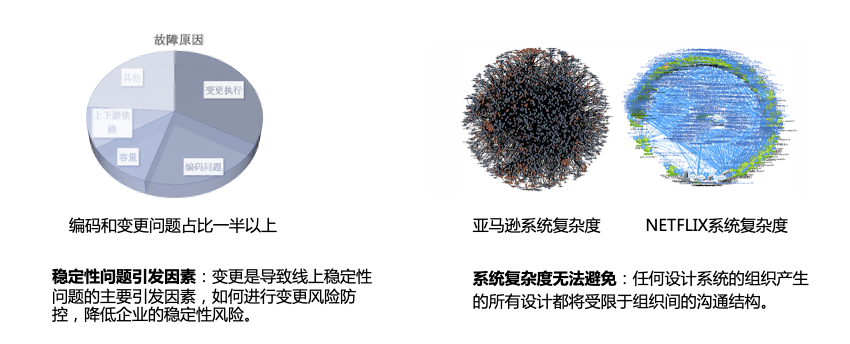

同时，由于分布式所带来的系统复杂度、业务越来越复杂所带来组织间关系的复杂度。导致了像亚马逊、NetFlix、蚂蚁集团这类业务体系庞大的公司，变更的问题就更为严重。

### 变更管控的思路

虽然说业界有了上述的一个共识，但诱发线上问题的根因是多种多样的，比如编码引入的Bug、变更人员的疏忽、人员之间沟通不到位等等。同时，随着业务体量的不断增大，组织划分与团队协作关系也会日益复杂。这种关系是符合康威定律的，也就是说组织关系的复杂会引发沟通成本的加剧，也间接导致了变更问题难以管控。

所以，对于变更管控的思路，业界最基础也最容易实现的方案是做事件的感知 + 计划报备审批。但这种方式的弊端在于强依赖审批者的专家经验，且无法扩大变更管控的规模。

我们在蚂蚁集团实践的变更管控思路是：**在整个变更的生命周期中（包括变更事前的计划报备、提前的变更风险及影响分析、变更中的异常观测、变更出现异常的熔断及自愈、变更完成后的变更度量及审计），以系统化的手段去防控和管理约束变更流程，使变更流程实现“三板斧”：可灰度、可观测、可应急**。

## 那么，AlterShield 是什么？

**AlterShield 是作为变更管控领域中一款集变更感知、变更防御、变更分析于一身的一站式管控平台。旨在通过定义变更标准协议，规范变更管控流程，使得用户可以快速发现变更中的问题，并及时降低故障影响面。**

AlterShield 是蚂蚁集团内部研发了近 5 年的变更管控平台 OpsCloud 的开源版本。经过多年大型互联网公司内部复杂业务场景的驱动，OpsCloud 在变更管控领域沉淀了丰富经验，是蚂蚁集团内部全部类型变更的统一管控平台，也是业务研发、质量测试、SRE同学日常进行变更感知、变更分析、变更异常识别的重要入口，在蚂蚁集团的变更风险防控上取得了显著的效果。我们非常希望能将这些经验和业界进行共同探讨与共同演进，为此我们开源了 AlterShield，因为整套变更防控系统较复杂，我们会逐步将所有的功能共享到社区，也非常欢迎大家来和我们交流关于你当前遇到的关于这个领域遇到的问题。

# AlterShield 整体技术架构

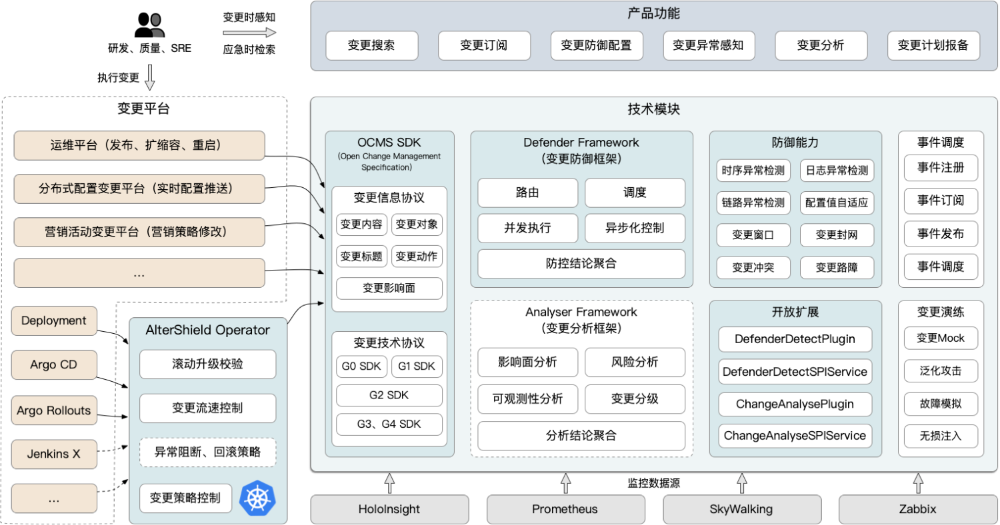

在技术架构上，AlterShield 分为以下几部分内容：
1. 产品功能层：面向研发、质量、SRE同学，提供变更信息感知及订阅、变更信息搜索、变更分析结果查看、变更计划执行流程、变更防御配置、变更防御异常检测结果感知的产品能力。
2. OCMS（Open Change Management Specification） SDK，我们想逐步构建一套标准的变更信息协议，未来在这个领域，大家都能够基于一套标准的协议，去进行各自的系统设计；目前的协议是基于蚂蚁集团的上千种变更场景总结归纳而来，非常初期的一个版本，这部分也欢迎大家来一起演进，协议包含两部分内容：
  a. 变更信息协议：这个信息协议是上层变更平台与后续所有功能模块间进行变更信息交互的标准信息结构。
  b. 变更技术协议：一种按代际区分不同变更生效流程的SDK，所有上游变更平台通过该方式对接 AlterShield 进行前后置切面的管控。
3. Analyser Framework（变更分析框架）：在OCMS SDK流程中，提供了变更前的影响面分析、风险分析、可观测性分析能力，会对变更内容、变更影响面、变更执行策略进行分析，同时基于这些分析结果，给出本次变更的风险分级，能够描述这个变更可能存在的危险程度。
4. Defender Framework（变更防御框架）：在OCMS SDK流程中，提供了变更中异常识别手段的路由、调度、并发执行、异步化控制能力，最终给出变更是否准入或可继续的判定。
5. Defender Service（变更防御服务）：AlterShield 在防御框架中集成的全局通用的防御能力。如：可观测性领域的异常检测、配置变更中配置值的自适应校验、变更窗口及封网的管控、定制模板的变更参数校验。
6. 开放扩展：以Plugin、SPI的形式，集成不同领域对于变更分析、变更防御的不同诉求，并以配置化的形式进行路由、执行，能够更加灵活的满足不同变更场景、不同业务场景下的风险防控诉求。
7. 事件调度：AlterShield 中各个模块间的交互方式都是通过内部事件来进行的，同时也负责各防御能力、分析能力的并发调度执行。

上面介绍到的模块，我们都会陆续在Github仓库开源，也欢迎大家一起来参与，接下来，我们将结合 AlterShield 中几个关键模块，来详细介绍下我们的变更管控思路。

## 什么是变更？

### 变更的概念

在做变更之前，我们必须先弄清楚，什么是“变更”，或者说什么是我们稳定性领域所关心的“变更”？业界通常把“Ops”当做变更，但“Ops”更多指的是研发、运维人员做的偏运维动作。在变更管控领域，“变更”这个概念要比“Ops”在范围上大很多。

所以，我们最开始对变更的定义是：**任何导致线上服务状态发生变化的行为叫做变更**。

然而这样的定义过于模糊。比如“状态”这个概念，如果说服务依赖和包含的持久化数据是一种显而易见的状态，那么服务当前所处的、时时流逝着的时钟是否算作“状态”？再比如数据显而易见是“状态”，那么如果用户打开支付宝发起一笔转账，这个行为是否属于“对账务系统的记账表数据状态做了变化”从而应该视作变更？

带着这个问题，我们分析了历史上由变更引发的线上环境故障案例。发现一个共性：它们都是企业内部人员通过某个平台或黑屏命令进行的线上操作。这些内部人员从运维、研发、产品到活动运营等，涵盖了多种角色。于是，变更，或者说做变更管控所需要关心的变更，指的就是“**内部人员触发的任何导致线上服务状态发生变化的行为**”。因此Linux时钟滴答不是变更，用户转账也不是。

### 变更标准化协议（OCMS-Open Change Management Specification）
在圈定了我们的目标范围之后，另一个要解决的问题是：单一系统发起的变更，其影响范围并不局限于这个系统本身，这对于研发、运维人员的经验性带来了极高的要求与分析成本。同时，每个企业所处的业务背景不同，甚至同一家企业不同的业务部门之间也存在着较大的差异与壁障。这个问题导致各个企业或部门所做的变更在语义、描述方式和生效方式等方面有着巨大的差异。

举个简单的例子：对于传统运维变更、业务运营配置这两类变更来说，在公司内部承载的平台可能是两个，且由不同的业务线团队来负责。那么这种差异就会导致这两类变更对于信息的定义（比如变更的内容、对象）、变更的生效模式（运维变更可能是按照服务器维度生效，业务运营配置更多是DB/内存/缓存中的数据修改）、变更的影响范围等都有所不同。那么想要对这两类变更同时在一个平台上进行管控，不统一这种信息及技术差异，成本是极高的。

针对于上述复杂场景，AlterShield 定义了OCMS（Open Change Management Specification）SDK，其中包含两部分内容：变更信息协议、变更技术协议。

#### 变更信息协议

因此，AlterShield 在进行变更管控的第一步前提就是要做到不同背景下的变更信息及技术统一，其信息协议的定义可以参考下图：

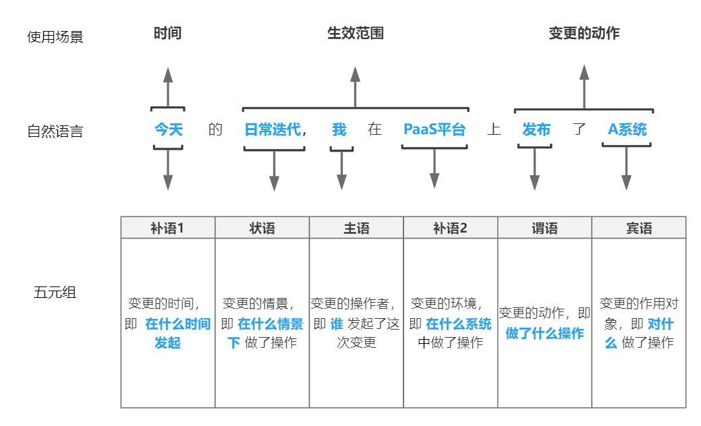
这样信息协议标准化的好处是：
1. 可以兼容不同背景下的各类变更，实现了多类型变更的“统一管控”
2. 屏蔽了上层业务场景带来的信息差异，使得变更管控后续的变更防御、变更搜索、变更审计可以基于一套标准的信息模型来进行
3. 为其他技术风险领域相关的能力（如应急定位等）的结合提供了一套统一的信息模型，能够帮助业务在发生问题时快速定位到相关业务链路所发生过的变更

#### 变更技术协议
在信息协议标准化处理之后，另一个问题就是上文例子中提到的“传统运维变更和业务运营配置变更，其变更生效模式不同”。这种流程上的不同，会导致变更在做管控时交互的机制不同。

再举个简单的例子：对于传统运维变更，通常是按照服务器分批生效的。那么对于这个变更单来说，变更管控平台可以在每个批次的前后做管控校验和信息收集；但对于DB配置类运营变更，由于DB数据仅有一份生效，所以在生产环境中的变更通常只有一个步骤，或者在上层通过UID控制分批生效。

因此，针对上述的变更流程和生效方式的不同。AlterShield 在技术协议上，通过前后置切面的形式，定义了“变更代际”的概念，从G0~G4共分为5个代际（G取自英文单词中Generation）：

| 代际名称 | 支持的变更流程和生效方式 |
| ------ |--------------|
|G0|以事件通知的协议接入 AlterShield，不提供管控能力，仅可做变更事件的通知、搜索|
|G1|对于无法按照批次拆分一步一步生效的变更，做单节点的变更流程管控|
|G2|可以按照批次拆分生效的变更（如集群服务器重启），做完整工单的变更流程管控|
|G3|在有完整的变更工单管控的基础上，增加了变更提单阶段的管控|
|G4|在变更提单管控的基础上，增加了变更无人值守的决策能力|
    
这种技术协议标准带来的好处是：**平台业务团队与风险防控团队有了明确的职责划分边界，以及一个统一交互的标准方式，变更平台研发的团队，更聚焦于平台研发本身，而SRE团队可以关注于变更的风险防控与治理，让更专业的人做更专业的事情。**

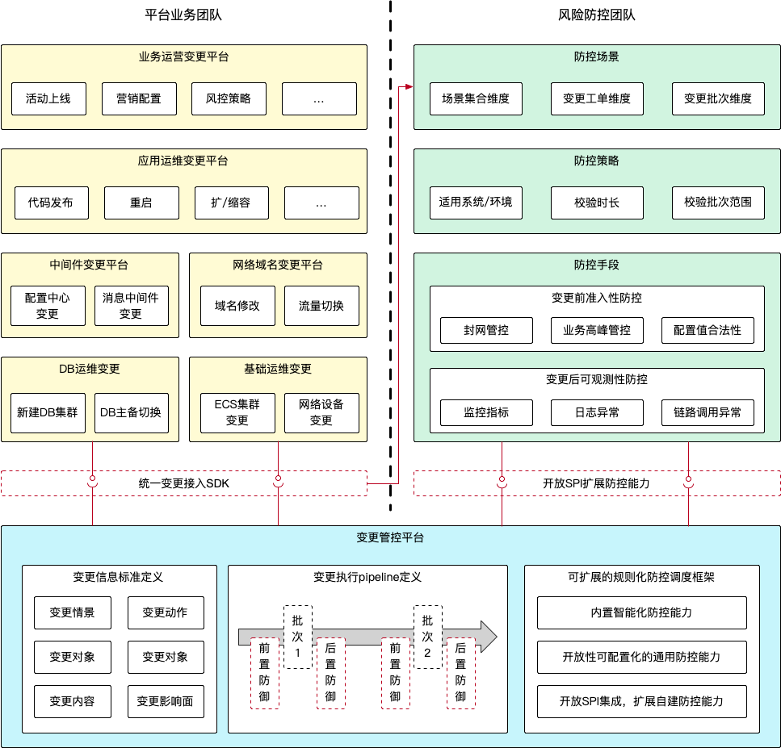

#### 云原生下的 OCMS 集成
云原生的发展趋势下，应用系统自身的部署、运维变更，都是基于Kubernetes或其它开源CI/CD工具进行的。对于这类下沉场景，AlterShield 提供了 AlterShield Operator，连接各类CI/CD工具到OCMS SDK。同时，Operator 本身也提供了变更流速控制、异常回滚策略控制等能力。

## 防控变更引发的风险
### 让变更渐进式灰度生效

金丝雀发布的思路来源是，矿井工人发现，金丝雀对瓦斯气体很敏感，矿工会在下井之前，先放一只金丝雀到井中，如果金丝雀不叫了，就代表瓦斯浓度高。 在灰度发布开始后，先启动一个新版本应用，但是并不直接将流量切过来，而是测试人员对新版本进行线上测试，启动的这个新版本应用，就是金丝雀发布模式，下图简单描述了下一个金丝雀的大致逻辑：

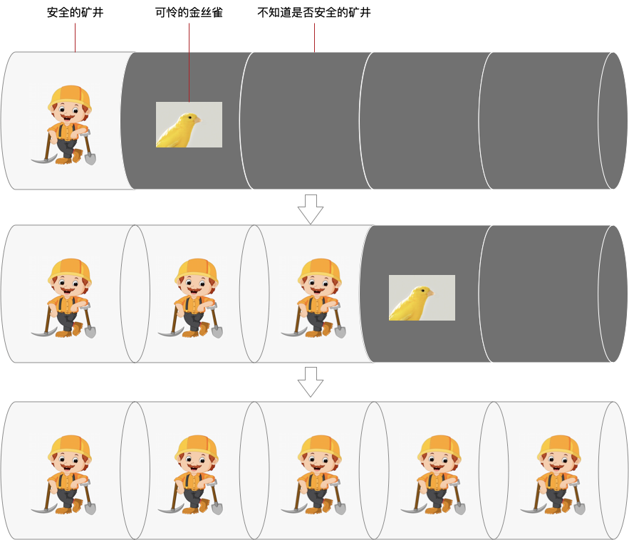

矿井的做法，不再试图分析瓦斯的化学成分，从而找到这种成分的显影试剂从而判断瓦斯是否存在。而是直接通过金丝雀的表象反应(是否健康)来探测所有风险，从而解决了瓦斯以及其他可能的有毒气体的检测问题。而较之全部根因，表象的范围更小、探测手段更明确。
这样一种方式，能够在变更无法充分事前分析出风险的情况下，在真正执行期间，通过控制爆炸半径的方式，让变更可以逐步生效，能够减少未知变更风险引发的稳定性问题影响面，同时再配合上风险防御能力，能够有效的及时发现变更引发的问题，快速做拦截处置恢复动作。

### 可干预变更的风险防御能力

灰度的核心，是将变更动作拆分为可逐步生效的方式，比如代码发布可以按照机器的环境进行拆解。而一般性的变更，拆解维度不止有环境。我们试图解决变更引发的黑天鹅隐患的主要逻辑是：

+ 选择在一个**风险可控**的变更范围（这个范围对于稳定性的影响程度是可以接受的），将风险逐步暴露出来。
+ 再通过变更风险识别防御能力（金丝雀们）去检测变更后是否有异常情况发生。

于是可以说，以什么维度做拆解，取决于什么因素决定“风险可控”。“可控”意味着范围和风险线性关系。蚂蚁的故障最终表现在对外用户的业务流量上，流量和线性地分布在承载应用进程的机器上，同时，业务线性的分布在包括Pod、PID、UID、业务场景、机房、流量类型等在内的多种维度上。
前置转后置配合线性分批，形成了新的变更范型：

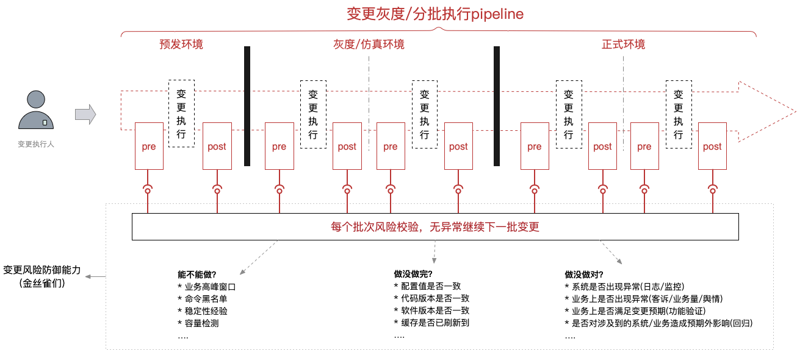

这样一个可灰度/分批的变更防控架构，把原本只能靠体验应急恢复速度来解决的问题，通过一个可控范围暴露风险，再利用充分的风险识别手段，不断将未知的变更风险问题逐步收敛。如果说之前我们期待基于历史归纳的前置规则能够回答所有可能的问题触发根因，从而在问题发生前避免之。那么此时，思路转换成了在每一个小批次之后，回答是否有问题。事实上，所有的问题根因无法穷举，使得前置校验的风险覆盖率低；同时相同根因的变更故障不常复犯，使得前置规则编写的ROI低。但变更对象及其影响面有没有问题，总是更容易回答的，且由于分批的引入，即使前面几个小批次出现了问题，由于范围可控，问题的严重性也可控。
至此，变更风险防控从面向已知问题的防控，演进到了面向未知的防控。从押宝前置校验演进到了前后置共同防控。

这套可灰度/分批的变更防控架构，有以下几个必要条件：

+ 固定流程的执行pipeline(强制风险发现/步骤可控)：
  +   执行按照预发/灰度/生产批次进行
  +   环境间/批次间串联
+ 变更分批执行能力(控制风险范围)：
  +   变更的生效需要能够区分环境
  +   线上环境按批次生效
+ 前后置防御校验(风险发现)：
  +   前置阻断变更、后置发现问题/阻断下一批次
  +   变更每批次的前后置需要布防

### 变更防御框架（Defender Framework）

基于前文的思路，在对平台业务与风险防控团队做了明确的职责划分之后，我们要做的就是为风险防控团队提供一套框架，以便为其提供更灵活、系统化的手段去检测变更过程中的异常，及时地熔断变更。

为什么需要灵活性？让我们思考一个场景：对于公司内部的管理系统来说，其做系统发布变更时通常只关注系统监控指标和核心日志就够了；但对于对客的业务系统，或者业务上的策略变更，除了关心上述指标外，还需要关注业务本身功能的健康情况（如：对客的展示页面是否白屏、业务活动预算是否充足等）。而且不同的业务变更，其关心的指标还会存在差异。

上述场景引发的问题是，即使统一了变更的信息差，对于后续的变更防御流程来说，也是不够的。因为**变更防御的观测手段，是随着业务背景不同，而发生灵活变动的**。这就是在之前，变更防御依赖人的经验性的原因所在。

对于变更风险防控这部分内容，AlterShield将其统称为“变更防御”。共分为：**变更防御框架（Defender Framework）、变更防御能力（Defender Service）、开放扩展服务**三大部分内容。

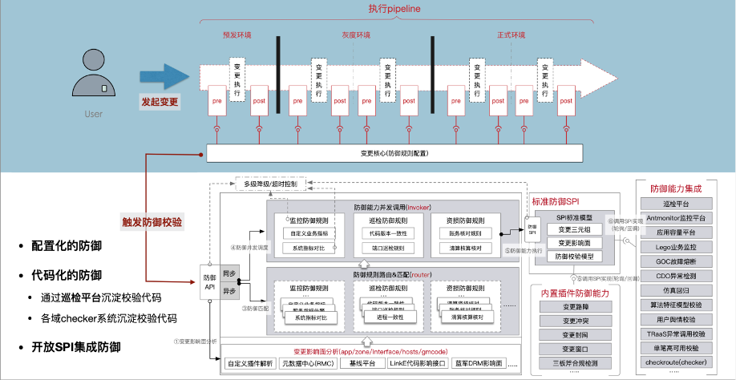

框架层所提供的核心能力是：
1. 防御能力路由：针对于不同变更，通过表达式配置的形式，路由到不同防御能力集合等待执行检测逻辑。以满足不同变更的防御校验多样性诉求。
2. 防御能力的调度与并行执行：各防御能力间相互独立，各自负责自己的校验逻辑，并按照一个“统一的结构”进行结果返回。这个结构在后文中会进行阐述。
3. 防御能力异步化：防御校验本身需要一定的时间（尤其对于可观测性相关的检测来说），这部分时间会带来变更效率的下降（因为操作变更的人员需要等待校验结论）。因此，针对分批次变更的场景下，防御框架提供了异步化校验的能力，利用变更本身执行的时间替换防御校验的时间，做风险与效率的平衡。

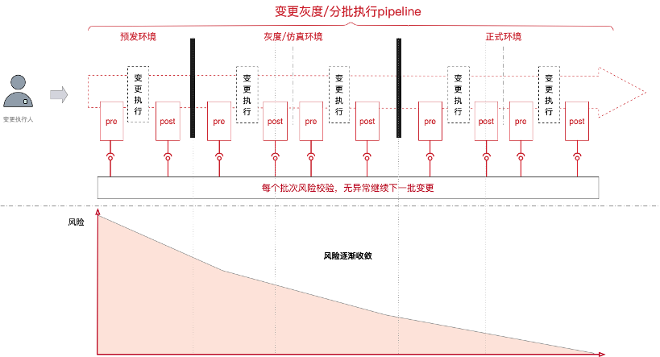
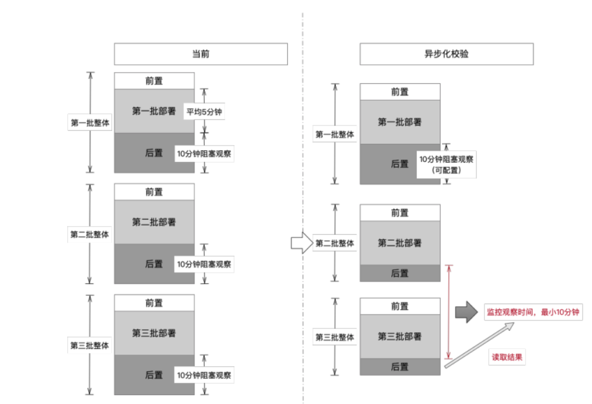

### 变更防御能力（Defender Service）

如前文所述，对于大部分变更来说，虽然部分使用的防御能力会存在差异（业务语义较强的部分），但大体上所需的防御能力仍是大同小异的（如：可观测性检测、配置变更的值校验、变更操作规范校验等）。这部分我们统称为“通用防御能力”，AlterShield 已在自身框架内部默认集成。

#### 时序指标异常检测 -- 分批变更监控

对于可观测性领域，OpenTelemetry 给出了清晰的三个子领域定义（Metric、Logging、Tracing），其中“Metric”指的就是监控中时序指标（如：CPU利用率、系统RPC服务调用成功率等）。AlterShield 针对时序异常检测，贴合变更分批次执行的背景，建设了“分批变更监控”。

如上如示意，变更场景和普通场景在时序异常检测的区别是，变更场景是有明显的两个时间点的：**变更开始、变更结束。因此，我们在获取到监控时序数据后，主要是做变更前后两段时序的对比异常检测**。

##### 短时序异常检测

在时序异常检测部分，我们使用了KDE模型进行（Kernel Density Estimation，核密度函数估计）。KDE是统计概率模型之一，统计概率模型是也是比较常见的异常检测思路。数据往往具有其分布规律，如果落在分布边界则触发了小概率事件，即为可能产生了异常。在正态中，99.73% 的数据分布在距平均值三个标准差以内（3-sigma）。那么，如果我们的数据服从一定分布，就可以从分布曲线推断出现当前值的概率。

反映到变更场景中，变更前和变更后的时序数据服从一定分布（例如正态分布），那么变更后的当前时间点数据如果超过 N-sigma，则可以判断为异常，一个简要的检测可以描述为：

三个标准差 3-sigma 是常用的标准，但它的问题是，真实的变更时序数据大部分无法假设其真实分布，即使是一个小时间窗口里的数据分布也很复杂，它不是一个简单的正态分布。相比而言，KDE 是一种非参数估计方法，对数据分布不附加任何假定，只是从数据样本本身出发研究数据分布特征。基于 KDE 的变更时序异常发现，主要流程同 N-sigma，主要是 step2 不同，它需要重新构建变更前样本的数据分布: X1、X2、... Xn 为独立同分布的 n 个样本点，设其概率密度函数为 f，则核密度估计公式为：

其中 h 为一个非负的平滑参数，称作带宽， K(.)为核函数(非负、积分为 1，符合概率密度性质，并且均值为 0 )。

核函数有很多种，例如：uniform、triangular 、biweight、triweight、Epanechnikov、normal 等。依据变更前数据求得概率密度函数 f 后，即可求变更后任意点的概率，进行异常判断。

另外，仅做变更前后的时序异常比对，极其容易出现由于各类突发、预期内事件导致的指标异动误判。我们回滚并分析了各类误报案例，总结并建设了基于对照组、背景组、历史组的准召率提升方案：

+ 对照组：同逻辑单元下未变更的服务器采集的指标数据
+ 背景组：该批次服务器历史n天内的时序指标数据
+ 历史组：该应用上次同类型变更前后的时序指标数据

#### 日志异常检测 -- 新增、突增异常检测

一个系统运行的情况，除了在监控时序指标上可以反映外，另外需要关注的就是其错误日志中，是否有异常堆栈信息，如下图：

AlterShield 针对此类日志异常识别场景建设了“新增、突增异常检测”防御能力，检测变更后错误日志中的异常变化情况，共分为两个阶段：
1. 训练阶段：将通用错误日志中的异常信息进行正则化处理，并将处理后的日志正则模板按照相似度进行分类，构造该系统的日志模板库。
2. 预测阶段：将系统实时采集异常日志信息同样进行正则化处理，并与模板库中全量模板进行相似度拟合，得出该异常是否为新增异常的结论；针对突增异常，需要计算异常模板计数，预测思路和上文时序异常检测思路相似。

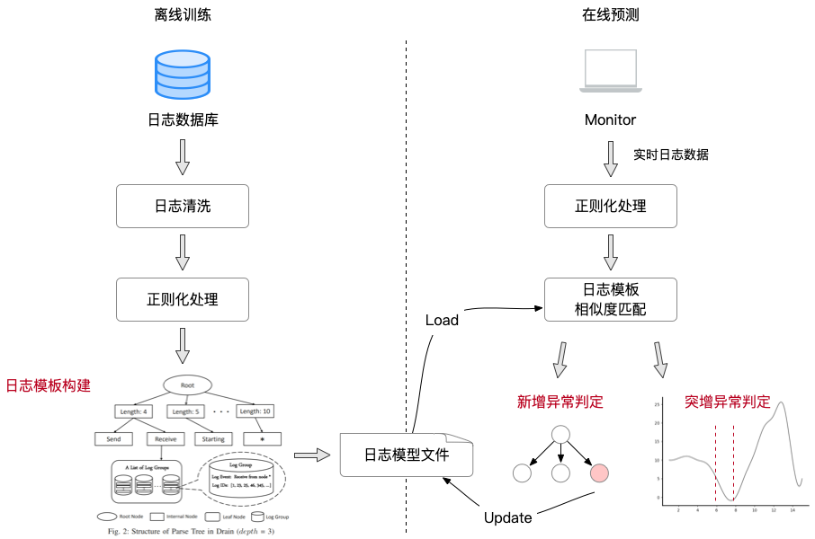

##### 异常相似度计算

在相似度计算上，AlterShield 使用了 Drain 算法，其核心思想是根据各个模板构造固定深度的解析树。当新的异常模板进来时，会与每个已有分支进行相似度计算，不相似则新增分支。

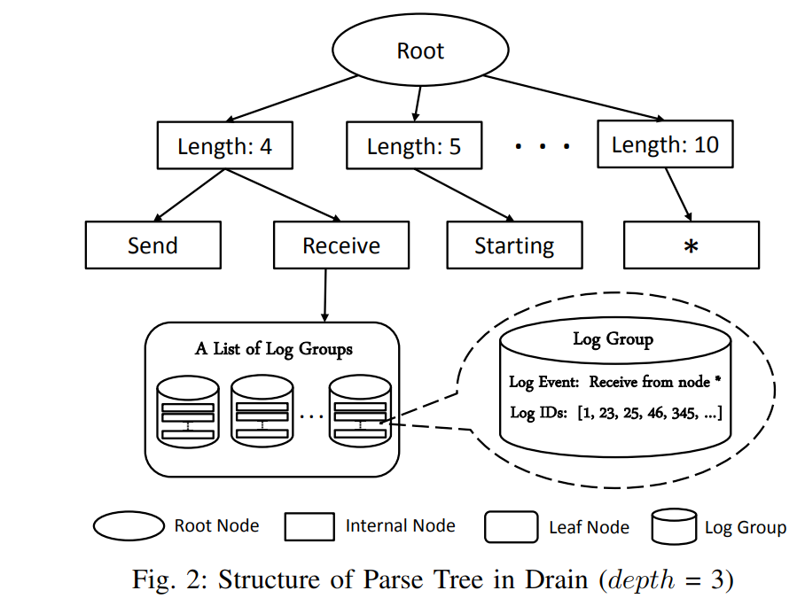

#### 链路异常检测 -- 链路错误码检测

对于单一系统的变更，其影响很可能并不局限于这个系统本身，更可能波及到其上/下游，或整个业务链路的入口/末尾。那么就需要变更后能够具备对整条业务链路进行异常检测的能力。

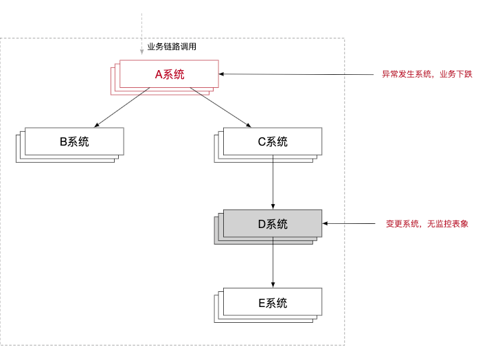

简单模式下，通过trace日志聚合即可反映出系统间每笔流量的调用异常情况以及业务错误码的变化情况，但这种方式的问题在于计算量过于庞大，极度损耗资源。

那么较为复杂的方式是结合中间件能力，将每笔流量的调用携带特殊标记进行透传染色，这样既能明确感知一笔流量所经过的系统链路，又能在透传的同时携带系统交互的关键信息，从而实现整条链路的异常检测。

AlterShield 正是借助 Sofa RPC 中间件的能力，将变更信息协议中的唯一标识位在整条流量链路上进行透传。再在链路的入口和末尾处打印全部流量中的业务错误码统计信息。这样，就将链路异常识别问题转换为基于日志的监控指标时序比对问题。后续异常检测的思路大致和“分批变更监控”相同。

在此你可能有些疑问：如果变更的系统，RPC服务异常导致上/下游根本接收不到消息，就不会在链路的入口和末尾打印统计日志了。那么这类异常怎么识别呢？

其实，对于RPC服务的来说，各类主流框架都是支持打印统计日志的。一旦出现失败量突升，在统计日志中即可反映出来。所以，这个问题是属于“单系统的监控时序指标校验”范畴，也就是说利用前文提到的“分批变更监控”就可校验出来。

#### 配置值自适应校验

对于配置类型的变更（如：分布式内存配置变更、营销活动配置变更等），一旦提单人员疏忽填写错误或遗漏，也会导致线上问题。同时，这类配置可能数量极其庞大（在蚂蚁集团内部有上千万+），靠人工进行梳理是不现实的。

因此，对于历史上正常完结没有回滚的配置变更，AlterShield 根据其变更值进行特征提取，学习该配置的key、value变化规律，从统计学、正则、枚举等多个角度构造每个配置值的特征组。当新变更到来时，就转化成了特征相似匹配，从而发现人工填写错误的问题。

另外，除 AlterShield 提供的上述防御能力外，风险防控人员也可将自己在特定业务背景下的专家经验，以Plugin、SPI扩展的形式沉淀到 AlterShield 中，并以配置化的形式进行路由设置，生效到指定变更中。

# 社区建设

变更管控领域是提升生产环境稳定性的一个重要领域。相关的技术标准也在逐步完善建设起来，并推动这一领域的演进。在这样的背景下，我们也希望将 AlterShield 在蚂蚁5年的实践经验开放出来，与各行业的领域专家一起探讨学习，并逐渐丰富 AlterShield 自身能力与社区建设。

我们的开源工作在陆续准备中，当前还只是我们的0.1版本。首期我们会开源 AlterShield 的 OCMS + Operator体系。接下来我们的计划如下：
1. 提供完善的开箱即用及Q&A手册
2. 完善 Operator 能力：提供完整的变更策略控制、回滚策略控制能力。
3. 扩展 Operator 生态：集成更多的开源CI/CD工具当中，丰富感知及防控场景。
4. 原生防御能力下沉：在 Operator 中直接提供对接监控工具服务及异常校验能力。
5. 完善可观测性异常检测生态：集成更多的开源监控工具，提供异常检测能力。
6. 开源完整的Defender模块：包含防御框架、防御能力及开放扩展部分。
7. 开源完整的Analyser模块：包含分析框架、影响面分析、风险分析、可观测性分析及变更分级部分。
8. 开放独立的防御校验能力：使防御框架独立于OCMS SDK，无需接入改造，即可进行变更防控校验。

作为开源社区，我们欢迎各种形式的贡献，您可以参与到社区的共建的形式包括但不限于：
+ 错别字修正：帮助我们指正文档中的错误。
+ 问题及案例探讨：您公司中的变更故障案例，脱敏后可参与讨论，一期探讨解决方案。
+ Bug提交：帮助我们指出 AlterShield 中逻辑错误的地方。
+ 新功能场景探讨：任何 AlterShield 还不具备的变更领域功能，都可以一起讨论。
+ 完善 OCMS 协议：目前 OCMS 开源还处于0.1版本，如果在您的场景下有不能适配的情况，您可以直接参与讨论及扩充。
+ 完善 Operator 生态：目前 Operator 在0.1版本会对接Kubernetes Deployment，您可以在您的CI/CD工具下改造及对接 Operator，扩展其生态。
+ 对接更多监控工具：您可以将您所使用的监控工具对接到 AlterShield 提供的可观测性防御能力中，扩展 AlterShield 的检测能力范围。
+ 沉淀您的变更防御专家经验：您可以以Plugin、SPI扩展的形式，将您的变更防御专家经验沉淀到 AlterShield 中。
