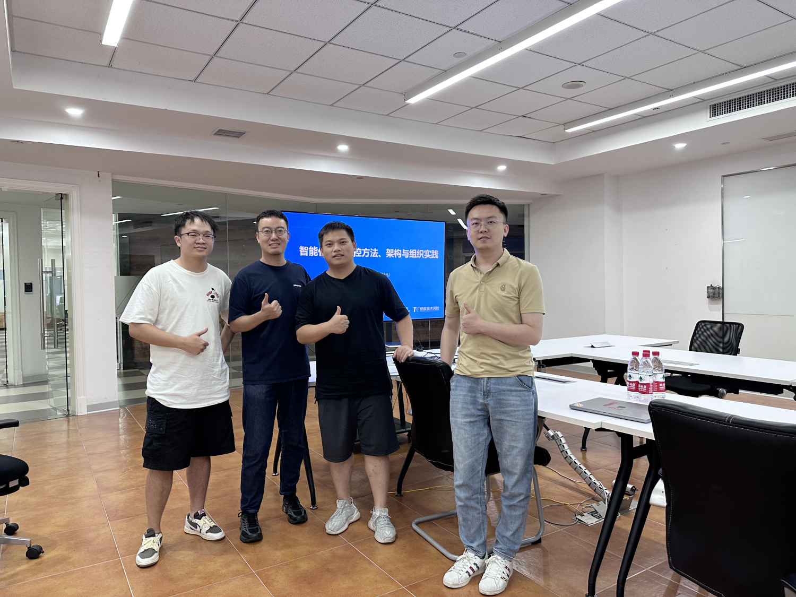

> 受同花顺稳定性负责人@杨征的邀请，蚂蚁集团AlterShield项目组的同学（王月凡、金亚龙）于9月15日下午14:00-16:00与同花顺的SRE高可用领域的同学在同花顺总部做了一次线下交流。其中参与的同学有稳定性负责人、SRE、测试、质量、开发。
> 

<!-- truncate -->

本次讨论主要涉及三个主要方面
+ 变更防控的价值
+ 变更防控的方法和架构
+ 变更防控的一些智能化实践

本次交流主要针对下面问题展开了讨论，这里记录一些大家重点讨论的一些问题。

**1、系统召回率算法？是否区分制度管控的规则和系统识别出的风险。**

A：故障作为分母，拦截次数作为分子。会区分制度管控规则和系统识别的，召回率统计只关注系统识别的部分。

**2、实际落地中，防御能力准确性较高，效果较好的有哪些？**

A：新增突增异常，时序异常检测等

**3、变更场景复杂，多变。如何解决标准化问题？**
+ 配置变更
+ 运营变更
+ 运维变更

A：OCMS SDK已经解决了标准化问题。

**4、风险识别建设比较宏观，难以发现业务代码层的问题，如何解决？**

A：通过程序分析手段，下钻到代码维度变更带来的影响。

**5、风险识别到改进的持续运营，是怎么做的？**

A：常态化运营，分析变更拦截case，变更故障case，故障的根因往往可以通过提供的防御框架将一些专家经验沉淀成防御规则。

**6、客户端发包的变更管控和服务端应用的变更管控都在一个平台实现吗？**

A：取决于客户端发包和服务端应用是否有运维变更平台。

**7、灰度计划和方案，在不同的业务场景下差异会比较大，平台侧是如何做管控的，到什么粒度？**

A：提供分批管控的策略，将变更的周期拉长有更多时间结合可观测手段去发现未知的风险。

**8、系统的管控接入，会影响整个devops流程的效率，如何平衡这个关系和推进系统接入？**

A：效率和风险一直是一个矛盾的话题，因公司业务、架构、背景而异。

**9、变更影响面评估是怎么实现的？变更影响面有哪些维度，输出的内容包含什么？**

A：一套完备的变更影响面模型，包括了程序分析的输出结果。通过trace分析代码、数据库、日志等之间的关系、链路。输出内容包括了影响的接口、表字段、日志等。

**10、如何管控方案设计侧的问题，走到最后变更的点是否已经晚了？**

A：设计阶段的问题较难管控。

**11、如何管控代码层面的问题（空指针，容错异常等）是否有左移的解决方案？**

A：可以通过一些自动化手段，在CI阶段扫描代码解决这些问题，程序分析技术。

**12、整个识别能力有没有和AI大模型结合的场景和案例？或者有无这块的规划和思路，可以做些讨论**

A：暂无。

**13、防御和识别能力的有没有制定标准？串联的哪些数字资产？**

A：防御框架的主要职责就是制定了防御的标准。串联了不同系统之间的程序代码、数据库、消息、接口之间的血缘关系。

**14、系统定义的风险业务方是否认可，业务如何自定义自身的规则？**

A：提供一套可扩展的SPI，有通用的规则，也有不同业务方针对自己系统的自定义规则。

**15、后置检测的能力如何深入到业务指标？**

A：结合可观测手段。

**16、测试平台和变更管控的边界如何界定？比如是否完成压测，单元测试覆盖率，这些是管控在变更侧还是测试平台？**

A：CI阶段应该发现这些问题并卡点，而不是等到变更阶段。

## 总结
同花顺是一家典型的金融企业，主要经营基金、股票和证券交易业务，风险容忍度极低。最近一次变更故障导致了严重的后果，希望通过一些系统化的方法来降低变更引发风险的可能。
在与同花顺的沟通中，我们了解到他们更关注风险的左移，即希望在变更之前做更多的准备工作。由于业务的特殊性，比如周末休市业务量较小和业务代码错误bug难以发现等问题，同花顺特别注重稳定性。他们将1018这一特殊的日期视为稳定性的重要日子，类似于蚂蚁公司的1218，这表明他们非常重视变更引发的问题。我们将继续与同花顺保持沟通和交流，确保能进行一些更多开源社区的互动与交流。