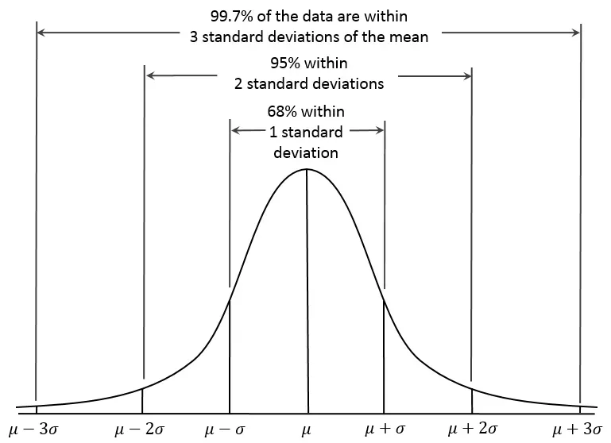

> AlterShield 是一款能够有效进行变更风险防控，预防变更引发生产环境故障的变更管控解决方案。
> 它是蚂蚁集团内部变更管控平台 OpsCloud 的开源版本。它凝聚了蚂蚁集团在公司大规模变更下积累的变更管控技术、产品以及方法论。在复杂业务场景下，提供变更过程中的生命周期感知、变更防御、变更熔断能力。

<!-- truncate -->

AlterShield主端代码仓库github地址：https://github.com/traas-stack/altershield

AlterShield-operator仓库github地址：https://github.com/traas-stack/altershield-operator

AlterShield-monitorCheck仓库github地址：https://github.com/traas-stack/altershield-monitorCheck

开源项目官网：https://altershield.io/

# 01、背景介绍

AlterShield在今年6月份发布v0.1版本之后，一直沉寂了很长一段时间。因为我们也不确定在蚂蚁内部的这一套变更管控的实践方案是否真的是大家想要的，大家所需要的。想要管控变更首先需要对变更有一个清楚的定义，在蚂蚁集团内部多年的实践经验来看，我们沉淀了一套变更管控描述变更的标准信息模型-Open Change Management Specification。在v0.1版本中开源了SDK模块以及整个变更管控系统设计架构之后，我们与SRE领域内一些经验比较丰富的同学进行了多次深入交流。

+ 今年6月份举行了第一次线下MeetUp，在与联通软件研究院、bilibili的同学交流中，大家都认为变更管控是非常重要的，并且都很关心变更管控如何接入实践。
+ 随后在7月份同美团、oppo的稳定性领域从事相关工作的同学举行了一次线上的MeetUp，大家聚在一起讨论了变更管控的价值以及业界比较关心的变更防控智能化。
+ 9月份我们去往同花顺的总部(杭州)，与同花顺的SRE领域内同学进行了一次线下交流。大家也是对变更管控的实践、价值和智能化比较感兴趣。同时还探讨了变更防控与当前火爆的LLM技术是否有一些结合或者实践。

这半年来，我们与行业内多达10+公司的相关领域内同学做了比较深入的交流，其中有金融属性的公司、也有互联网属性的公司。大家或多或少都经历过一些重大的因为变更引起的故障，稳定性一直是一个重要命题，守正才能出奇。由变更引发的故障更是数不胜数，因此如果能够把变更引发的风险通过有效的技术手段、智能化手段降低将会是一件非常有价值的事。

经过长达半年的努力，我们将内部的变更管控系统OpsCloud（SofaBoot技术栈）基于开源社区比较受欢迎的SpringBoot框架完全重构设计，去除迭代了多年引入的一些历史包袱以及糟糠代码。同时我们从0到1设计了一个用于感知云原生场景下的变更的operator应用，提供了一套通用的workload防控框架，将变更管控的范围扩展到了云原生场景。

智能化变更防控手段也是大家比较感兴趣的一个命题，本次v1.0版本同时发布了蚂蚁内部自主研发的一些算法服务。

# 02、新版本重点解读

## 一、主端最小可运行完整版本发布

v0.1版本发布了：OCMS-SDK、AlterShield Operator

本次v1.0版本开源了上图中：
+ DefenseFramework变更防御框架
+ 变更技术协议
+ 开放扩展能力
+ 事件调度

> 主端模块介绍
+ altershield-bootstrap：启动模块
+ altershield-change模块：变更技术协议模块
+ altershield-common模块：通用的服务、工具类模块
+ altershield-defender模块：变更防御框架
+ altershield-framework-sdk模块：OCMS SDK
+ altershield-framwork-spi模块：开放扩展模块
+ altershield-plugin-market模块：开放扩展模块的调度中心（调度内部实现的SPI或外部打包上传的插件）
+ altershield-schedule模块：altershield的底层组件，基于数据库实现的两层事件分发调度中心
+ altershield-shared模块：模块间共享的服务
+ altershield-web模块：对外的http接口（SDK接入 & DashBoard接口）

## 二、智能变更防御算法服务
### 背景介绍
在云原生大型在线服务系统中，微服务系统中软件变更行为频繁发生。在软件变更期间，引入新代码、更改配置或更改代码的行为，都可能会引起服务中断和生产事故，从而破坏用户体验、引起用户不满，这将带来巨大的经济损失。根据Google SRE的运维经验，大约 70%事件与软件变更有关。曾经，Facebook出现严重的宕机行为，全网宕机近七小时。因此，快速识别软件异常变更，降低事故影响，提高系统的可靠性，成了软件运维的重要事情。

### 技术方案
在发布流程中，往往会采取研发/SRE/运维同学盯盘监控的方式进行业务分批发布上线，这样可以在业务出现分析概念时能够及时被监控到并进行业务止血操作，防止变更引入的风险进一步扩大，从而影响到大量用户。而在蚂蚁内部，依托于变更管控平台，我们提供了一种可实现变更时自动盯盘变更应用监控项的能力：智能分批监控校验。该监控盯盘能力主要是根据变更应用获取其相关监控项，并在某批次机器变更「如应用发布、配置推送」后对该批次变更机器变更前后的监控时序数据进行异常检测。

### 整体架构
在蚂蚁集团内部，「智能分批监控校验」服务依托于MaaS、Pontus、Alarm GS等相关基础服务运行，分别承担整个校验逻辑中的监控项下发、数据采集通知、监控数据拉取等能力。考虑到以上服务暂未有开源计划，同时我们有意向将「智能分批监控校验」此能力开源，所以针对整条校验链路进行了二次重写。

**重写前项目架构：**

**重写后项目架构：**

变更平台 - AlterShield 接入 - AlterShield 防御 - Plugin「轮询」- Metrics Client - BatchMonitorCheck

### 异常校验
在变更监控的算法实践中，我们核心的要解决的问题是短时序的异常检测。一条待检测的数据通常包含变更前 30 分钟的时序，和变更后 5 ~ 15 分钟的时序，理论上一次正常的变更，系统指标在变更完成后会恢复和变更前一样的状态。为什么是检测数据是短时序，原因有以下：
+ 因果关系，我们只是为了检测变更前后状态是否有异常，参考变更前太长数据并无意义。
+ 变更效率，机器的变更都是分 n 批次串行进行的，后置校验每增加 1 分钟，整体变更时间变慢就会放大 n 倍，变更后校验不能太久否则会影响业务变更效率。

面对这种短时序的异常检测，实践过程中面临主要问题有：
+ 时序数据太短，且无历史标签。短时序意味着关于变更能利用的信息量小，同时由于数据建设的原因，相对海量变更几乎没有真实标记什么是真实变更问题，无论是算法设计和算法验证都难以开展，巧妇难为无米之炊，算法选型的余地非常小。
+ 噪声，变更中的短时序抖动是经常出现的现象，这种抖动很容易被算法识别拦截，但识别出来的又通常是噪声。噪声太多导致平台侧没有精力对拦截案例进行分析，也会严重影响用户体验与变更效率。

目前我们对于变更监控的智能识别方式，主要依靠 KDE 算法和特征统计方法「基于经验的特征设计」。

#### 1、监控异常检测之 -「KDE」

KDE 是统计概率模型之一，统计概率模型是也是比较常见的异常检测思路。数据往往具有其分布规律，如果落在分布边界则触发了小概率事件，可能产生了异常。在正态中，99.73% 的数据分布在距平均值三个标准差以内（3-sigma）。如果我们的数据服从一定分布，就可以从分布曲线推断出现当前值的概率。

反映到变更监控场景中，变更前和变更后的时序数据服从一定分布（例如正态分布），那么变更后的当前时间点数据如果超过 N-sigma，则可以判断为异常，一个简要的检测可以描述为：

**step1：取变更前时间窗口内的N个数值作为样本M**
> 针对变更前的异常数据点进行过滤，具体方法为：
> 剔除掉被定义为大于 99.5% 百分位数或小于 1% 百分位数的数值。

**step2：计算样本的M的均值μ、标准差σ**

**step3: 当变更后时序时间点$|X_i - μ| > z_c * σ$时判断异常，其中$z_c$为分布的分位数**

三个标准差 3-sigma 是常用的标准，但它的问题是，真实的变更时序数据大部分无法假设其真实分布，即使是一个小时间窗口里的数据分布也很复杂，它不是一个简单的正态分布。相比而言，KDE 是一种非参数估计方法，对数据分布不附加任何假定，只是从数据样本本身出发研究数据分布特征。

基于 KDE 的变更时序异常发现，主要流程同 $N-sigma$，主要是 step2 不同，它需要重新构建变更前样本的数据分布:

$x_1，x_2，...，x_n$为独立同分布的 n 个样本点，设其概率密度函数为$f$，则核密度估计公式为：
$$
\hat{f}_h(x)=\frac{1}{n}\sum_{i=1}^{n}K_h(x-x_i) = \frac{1}{nh}\sum_{1=n}^{n}K(\frac{x-x_i}{h})
$$

其中$h$为一个非负的平滑参数，称作带宽，$K(.)$为核函数(非负、积分为 1，符合概率密度性质，并且均值为 0 )。核函数有很多种，例如：uniform , triangular , biweight , triweight , Epanechnikov , normal 等。依据变更前数据求得概率密度函数$f$后，即可求变更后任意点的概率，进行异常判断，若连续出现若干异常点，则可归类为异常点。

#### 2、监控异常检测之 -「特征统计」
传统的检测算法如k-sigma基于了正态分布的假设，不仅在短时序检测上会因为假设错误而影响检测准确率，在强周期的长时序上也难以识别出属于正常现象的周期上涨下跌。为此，我们采用短时序与长时序串联分析思路，短时序进行快速地异常发现，而长时序则进行周期性地校验分析，这能够使检测更加高效且鲁棒。同时我们也基于历史风险 Case 分析总结，沉淀了一套时序异常特征，用于特征统计计算。

### 三、operator架构重构升级
AlterShield-Operator 是一种在云原生场景下接入主端变更管控能力的实现。
它通过新增一种自定义资源—— ChangeDefense，以支持用户指定管控的 k8s 对象、变更过程中进行防御的时机，以及检测到风险后的行为。例如，在下图的示例中，指定对 default/test-app 这个 Deployment下的变更做管控，并且分别在25%，50%，75%的新版本 Pod 变更时，进行变更防御检测。

在指定上述的防御规则之后，当用户修改 test-app 相关定义时，Operator 会首先通过主端做变更前置校验。此外，在变更达到指定阶段后，Operator 会阻断变更，并通过主端进行变更防御校验，以识别过程中的风险。

目前，Operator由如下部分组成：

1. WorkloadMutatingWebhook：一个 k8s mutating webhook。在接收到管控的工作负载的更新事件时，它会调用主端进行变更前置校验，并将相关的变更防御元数据记录在工作负载对象上。
2. ChangeDefenseController：自定义资源 ChangeDefense 的控制器。当管控的工作负载对象更新时，它也会调和关联的 ChangeDefense 对象。特别地，它会根据工作负载对象上记录的变更防御元数据，生成 ChangeDefenseExecution 对象。后者也是 Operator 新增的一种自定义资源，主要记录每次变更防御执行的数据，包括执行状态、变更对象（如 Pods）及防御结论等。
3. ChangeDefenseExecutionController：自定义资源 ChangeDefenseExecution 的控制器。它会实时地记录变更对象的信息，并且当变更执行到用户指定的阶段后（如上述示例的25%,50%...），触发主端执行变更防御服务。
4. PodValidatingWebhook：一个k8s validating webhook。在接收到 Pod 创建删除事件时，会根据变更防御执行状态进行拦截或放行，已控制变更节奏。
5. AlterShieldCallbackHandler：一个http server。它接收所有来自主端的防御执行结果回调，并根据执行结果更新变更防御执行状态
6. MetricsProvider：一个http server。它接收来自主端变更防御模块的请求，通过 Prometheus 或者 k8s metrics api 提供算法所需的时序指标数据。

## 四、Quick Start
我们提供了一个详细的dev版本的Quick Start文档，如需了解更多可以前往AlterShield官网查看，地址：https://altershield.io/zh-CN/docs/quick-start/dev-quick-start。

# 03、未来展望
## 一、AlterShield主端
目前AlterShield主端已经提供一个完整可运行的版本。AlterShield作为一个中心化系统，同时服务于稳定性领域，这个系统的高可用要求非常之高。系统在设计之初考虑了很多稳定性的设计。比如系统降级入口、心跳机制、分库分表等等，这部分功能后续将持续的改造优化后开放，也欢迎大家参与进来一起共建。同时我们后续将开放更多的通用SRE专家经验沉淀的防御能力给大家，目前开放的altershield-framework-spi中定义了标准的扩展能力接口。也欢迎大家尝试编写自己的防御服务插件。

目前版本暂未提供可视化的UI操作界面，后续Dashboard也会列入下一个版本的计划中，同时也欢迎加入AlterShield社区一起共建。后续将补充简单易用的部署脚本以及部署教程到AlterShield官网。

## 二、算法服务
由于对于开源算法能力改造投入有限，一期暂时仅支持短时序异常检测、长时序异常检测、KDE异常点分析、特征统计等能力，基于以上能力，能够很好的做到针对异常时序曲线的识别与拦截。但是，在实际业务生产中，仅仅关注召回率「风险拦截数/风险数」往往是不够的，如果我们针对每一笔变更都稳定拦截，召回率可达100%，并不能说明该算法的有效性。用户打扰率「拦截单数/变更单数」、准确率「有效拦截单数/拦截单数」也是评判算法能力的重要指标，而对于用户打扰率的降低和准确率的提升，我们必须要做的事情就是在保证拦截召回率的情况下，投入部分时间去做降噪处理。

针对于降噪的手段，我们预计会在后续的版本会提供以下能力：

+ 历史组特征分析&短时序检测降噪方法
+ 对照组异常波形比对降噪
+ 多指标联合分析降噪手段

虽然后续版本更多的会关注于降噪部分的逻辑，但是针对变更本身异常检测的能力的提升也是不可或缺的，同时在后续的版本中我们会提供一种基于影响面分析的多应用监控异常检测能力。
+ 上下游应用影响分析+监控盯盘

最后，不管是业界还是蚂蚁集团内部，对于变更监控异常的检测，依旧存在一个未能有效解决的问题，那就是「小、无流量变更监控异常风险识别」问题，目前我们也针对该问题尝试搭建一套针对事前、事中、事后风险分析以及历史流量mock的手段去解决该问题，同时也希望能够集思广益，联合业界或开源社区有意共建的朋友们参与到该问题中，一起攻克这类风险识别难题，为稳定性领域添砖Java～
+ 挑战性：小无流量风险识别

## 三、AlterShield Operator

+ 更多的场景或管控对象：目前仅支持原生Workload，未来可以考虑支持更多的工作负载；或者不仅限于工作负载，比如Service、Ingress等4/7层网络配置场景。
+ 插件化部署：将变更防御能力作为一种插件引入到ci/cd流程中，使智能变更管控覆盖更多使用场景。