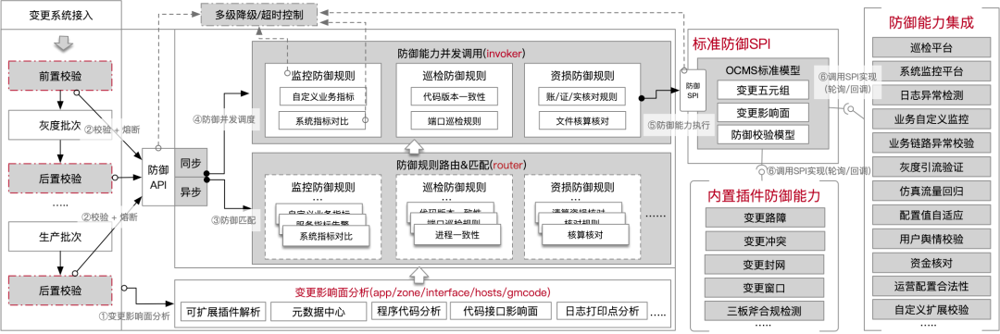

> 受唯品会同学的邀请，`12月26日 15:00-17:00` AlterShield社区同学同唯品会的同学通过线上腾讯会议的方式进行了一轮交流。
> 
> 参与的同学有唯品会基础架构效能部同学以及蚂蚁集团AlterShield开源社区负责人金亚龙、俞灏宣、付锦飞。

<!-- truncate -->

MeetUp议程如下：
1. 唯品会分享变更内部实践，以及实践过程中遇到的一些问题和比较关注AlterShield能力的部分
2. 金亚龙分享AlterShield目前开放v1.0版本的能力现状和特性
3. 结合前面分享针对下面问题展开了重点讨论
   + 变更影响面的建设思路
   + 变更协议代际的一些设计考量
   + 防御规则体系建设经验
   + 防御框架设计与实现

# 防御规则体系建设的方法论

1.故障牵引建设防御体系往往是比较有效的方式

2.形成完备的机制以应对一个新的故障发生的时候，有行之有效的手段来建设起对应的防御能力，防止同类根因故障的再次发生。
# 防御框架设计与实现

防御框架层提供的核心能力包括下面三个部分：
1. 防御规则的路由和匹配（router）
2. 防御能力的并发执行（invoke）
3. 防御能力异步化（sync）

## 自研简易高效规则引擎 - 与或表达式
左值匹配与或表达式执行逻辑

## 防御能力并发执行
基于事件中心的分布式调度。详情见主端的Schedule模块

👉[AlterShield-schedule](https://github.com/traas-stack/altershield/tree/main/src/altershield-schedule)

## 防御能力异步化

基于事件中心分布式调度

👉[AlterShield-schedule](https://github.com/traas-stack/altershield/tree/main/src/altershield-schedule)
