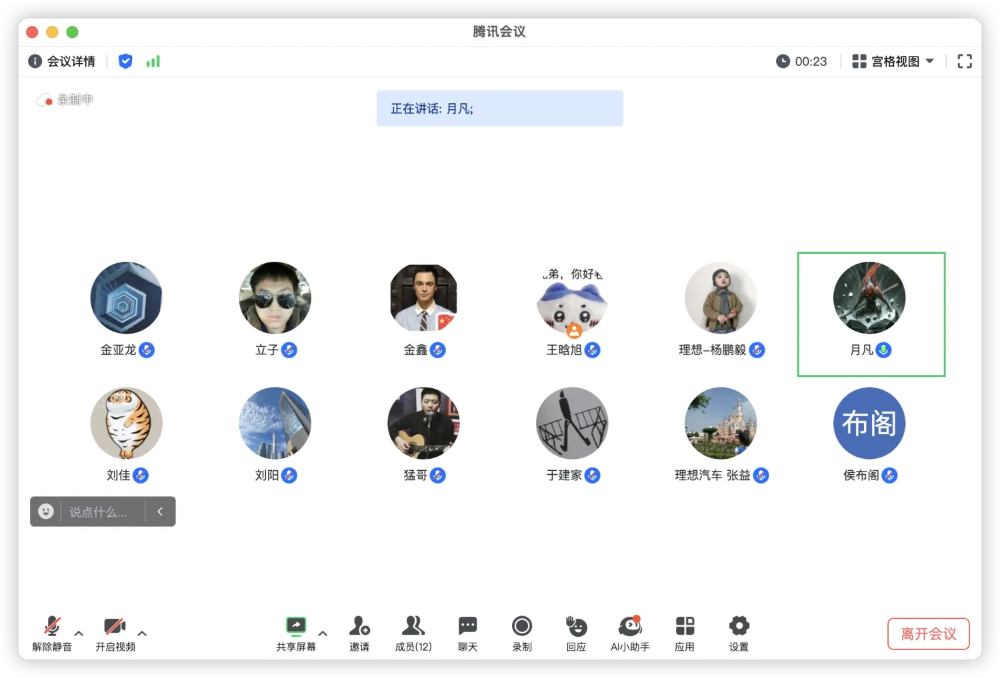
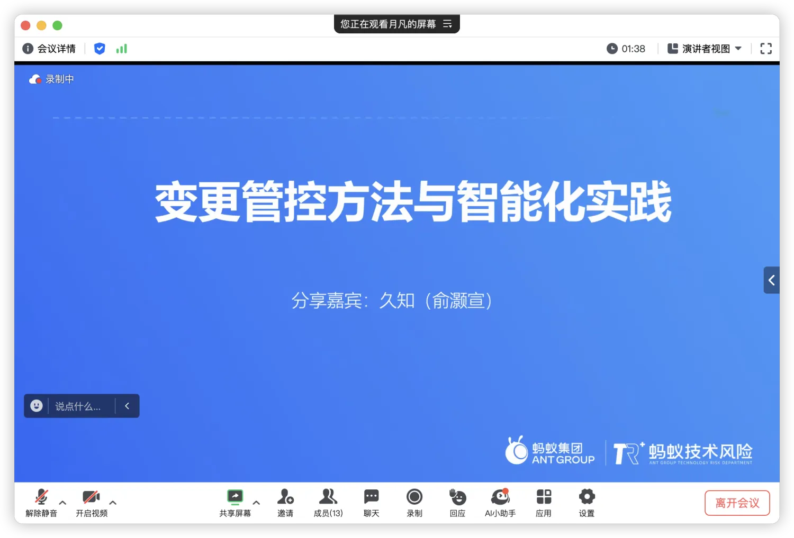
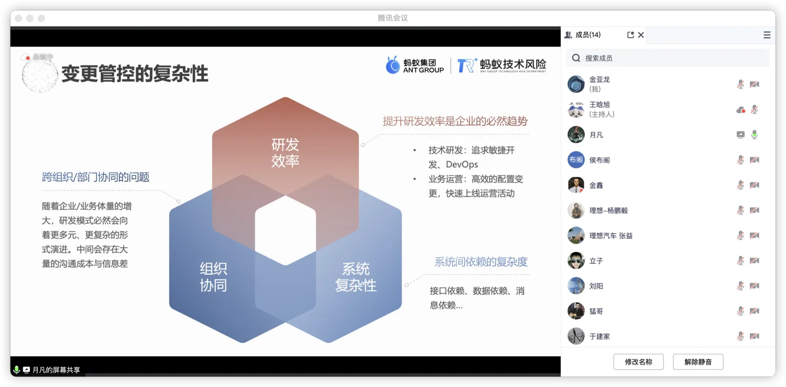
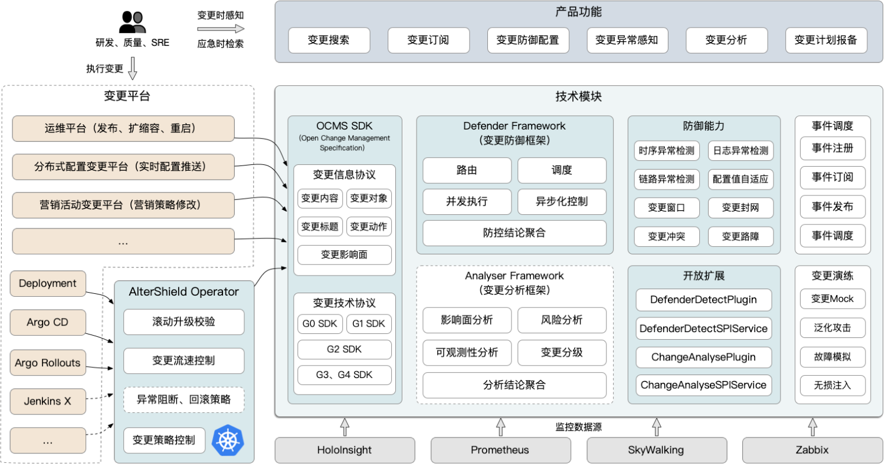

> 理想与AlterShield社区的同学于 `3月19日10:00-12:00`通过线上腾讯会议的方式进行了一轮交流。
>
> 理想参与的同学有稳定性平台的技术、产品同学。参会人数共计10人。
> 

<!-- truncate -->

MeetUp议程如下：
1. 俞灏宣分享了《变更管控的方法与智能化实践》

2. 对分享内容展开了一系列问题讨论

## 问题讨论

1. 日志标准化改造，推行变更管控遇到的阻力。

    中间件定义日志规范，业务定义日志规范，统一日志的格式，方便日志切割以及监控的配置。

2. 为啥要做变更管控平台，背景是什么？

    分析蚂蚁历史故障根因，发现大多数（至少70%）是因为变更引起的故障，因此如果能够将变更有效的管控起来，通过一些技术手段能够降低或者防控住变更过程中的风险将会是一件收益很大的事。

3. 接入到被管控整个流程，涉及哪些角色？
    
    接入前：
    接入后：

4. 后续的规划以及方向？
    
    变更的管控和效率是冲突的两件事，虽然风险降低了，但同时效率也降低了，技术手段相对成熟之后，可以探索无人值守方向以提高变更管控的效率。
    PAC（Policy As Code）将在后续的云原生领域的Operator中发布该部分能力，主要解决的是云原生场景下一站式的变更管控平台，所有变更管控策略均是通过声明式编码的方式实现。

5. 时序校验算法是使用传统的算法来实现吗？
    
    这部分是基于传统的一些时序异常检测算法来做工程化的接入实践的，经验证是一种行之有效的手段。

6. 变更平台接入的成本？

    单个变更平台约1～2周左右，取决于变更平台的复杂性以及自身架构设计是否灵活。

7. 团队规模不够大，如何低成本做变更管控？

   基于开源版本建设，节省变更管控能力本身建设的时间成本，节省变更防御体系框架能力的一些建设成本。
   对于运营、改造接入这种成本没办法节省。

8. 开源的版本功能有哪些？
    
    下图中蓝色部分均已开源，产品功能目前没有前端UI，主要以接口的方式提供服务。
    

9. 运营落地的一些方法论？

    让别人看到变更管控的效果，自上而且的推动。

10. 核心价值的指标是什么？
    
    变更故障数的减少。