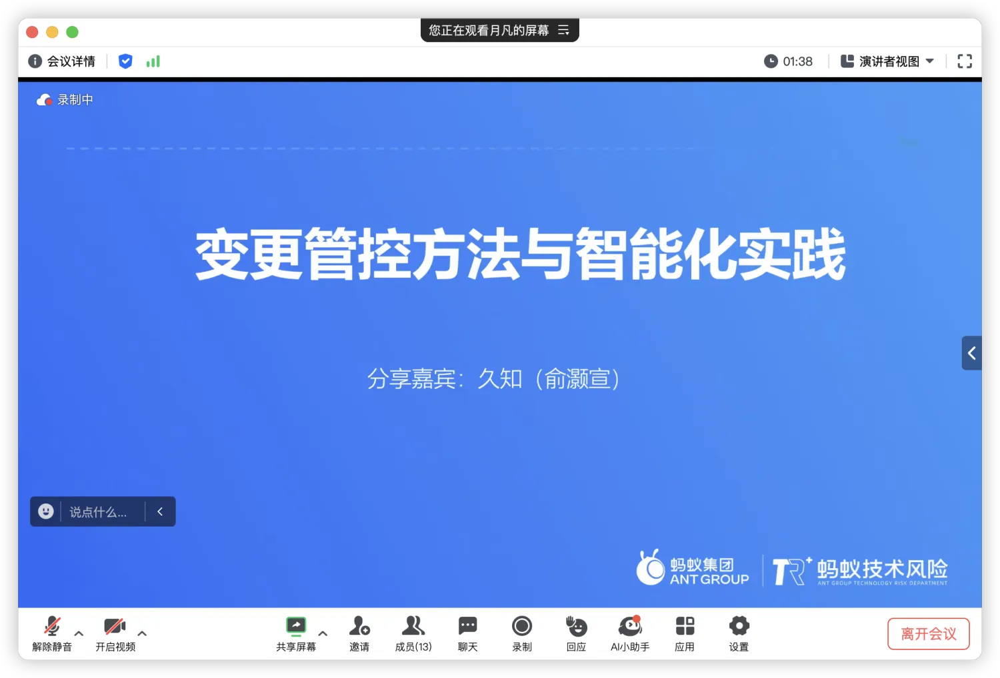
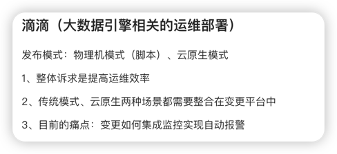

> AlterShield社区从3月份开始筹备，于`4月16日 10:00-12:00`举办了一次比较大的线上MeetUp。
> 其中参与的公司有国泰君安、同程旅行、滴滴出行、富途科技，线上参会人数共计25人。

<!-- truncate -->

**MeetUp议程如下：**

1. 蚂蚁集团俞灏宣分享《变更管控的方法与智能化实践》

2. 富途科技肖先敏分享了富途的变更管控现状以及主要的低效点

3. 同程旅行刘明松（运维研发负责人，故障生命周期研发负责人）分享了同程旅行内部变更管控的现状以及问题和痛点

4. 滴滴吉原杰分享了内部目前的一些痛点和诉求

5. 国泰君安郭建华分享了内部变更管控现状以及一些探讨问题

后续大家集思广益针对上述问题展开了探讨，相关问题讨论详情见下面。

## 问题讨论
1. 变更影响上下游如何分析的？

    静态程序分析：代码逻辑的影响（接口、db表、sql）。    
    动态分析：流量链路分析，元数据拓扑推导等等。

2. CMDB数据准确率？缺失或者实效性不够是否影响风险分析效果？
    
    会影响结果，作为中心化系统应该保证SLA。

3. 变更前置、后置校验会校验哪些项？具体有什么策略？

    变更前：封网、窗口（可自动化）、饭点管控、业务链路故障检测、容量水位监测、配置变更校验
    变更后：监控（系统通用指标、业务指标）、日志、链路
    变更完整性：配置推送是否成功
    策略均以Faas化方式提供（规则化）

4. 灰度是如何做的？

    灰度环境，灰度sdk，拉线上流量做内灰（员工、压测流量）

5. 券商业务（闭市后无流量）有什么建设变更管控的建议？

    券商比较适合做仿真环境的建设（周内录制、周末回放验证）

6. 如何确保可回滚？回滚依赖问题？

    发布时填写回滚镜像id，计划阶段统计变更顺序依赖，配置回滚代码化

7. 蚂蚁集团目前的容器化比例？
    
    目前100%容器化，主要区分在于是否workload化。

8. 变更可观测点如何选取策略是怎样的？

    应用监控：CPU、Load、Mem（沉淀历史经验）
    业务监控：根据业务语义做环比校验

9. 运维本身的变更，应当如何激励管理员（运维人员）将日常工作变更化？

    场景不同，蚂蚁有SRE角色。风险把控方式，降低运维人员的风险恐惧。

10. 复杂系统场景，如何做关联系统变更？

    跨系统依赖顺序问题 -> 流量采集、仿真流量回放
    配置相关问题：依赖人工事前在计划阶段编排

11. OCMS中的G0、G1代纪分级的依据？

    根据管控力度区分，不同变更风险程度不同。其中G0只需要做一个变更同步通知即可，而G1需要分批变更管控。

12. 接入工作阻力？业务配置变更平台覆盖程度？

    阻力非常大，目前接了 90% 以上，后续新增或评估风险较小的平台未接，通过制定规范、和责任承担机制驱动大家主动接入。

13. 蚂蚁集团建设变更管控的故障下降情况如何？

    变更故障占比下降了50%以上。

14. 是否有效率上的提升？为什么会降低？

    初期一定是降低的，后期可做到质上的提供（依托于无人值守）。分批管控，观测时间导致初期效率降低。

15. 是否对所有的变更强制要求分批？分批变更的占比？

    分批比例：70%-80%。是否强制取决于变更的业务形态。

16. 在变更管控建设之后，仍然会有新的变更系统的出现，如何防退化？

    人力（SRE）跟进梳理，挖掘分母完成接入，目前还在探索变更自动感知接入。

17. 监控数据的自动识别如何判断出异常？以及降噪？

    通过对变更机器变更前后监控数据进行比对，KDE算法提供特征。通过对照组、历史组方式进行降噪处理。

18. 变更目标出现冲突如何解决？

    针对变更目标添加路障锁。

19. 蚂蚁集团的变更管控部署架构是怎样的？是否是中心化的？

    目前是多云多站点模式，数据隔离。是一个中心化的系统。

20. 变更类故障的占比情况？

    量级有所降低，但是比例依旧较高（并非所有变更引发的问题都能发现，如历史问题暴雷）。

21. 故障发生时的定位是否有体现？

    变更搜索机制，快速检索。主动定位由更专业的变更定位团队负责此部分工作。

22. 事前的策略有哪些？

    风险分析辅助推导，事后的话强依赖分批能力。

23. 目前有哪些方式做阻断方式？

    平台调用 -> 变更管控 -> 平台回调

