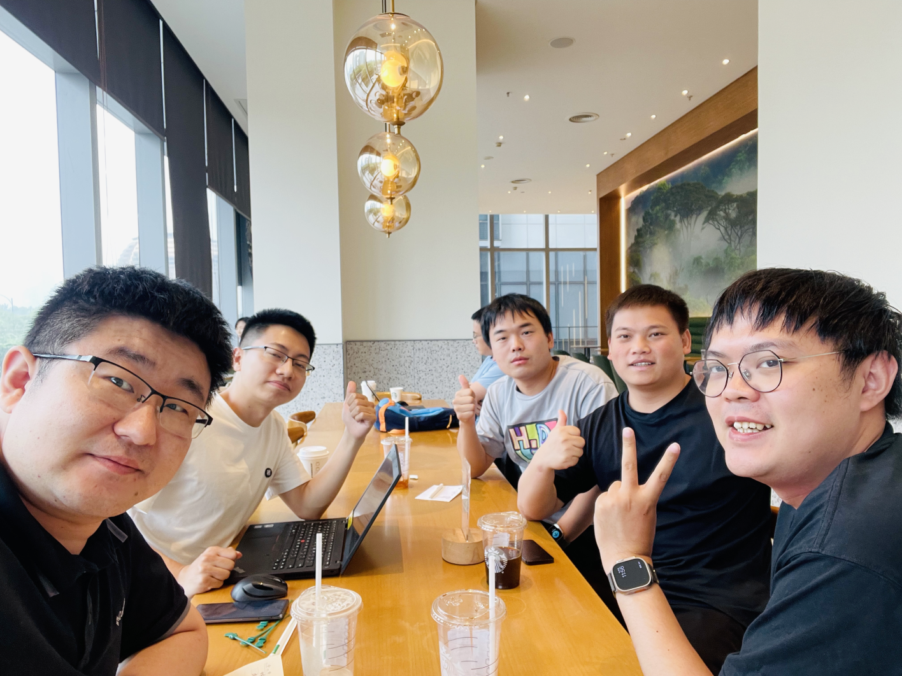
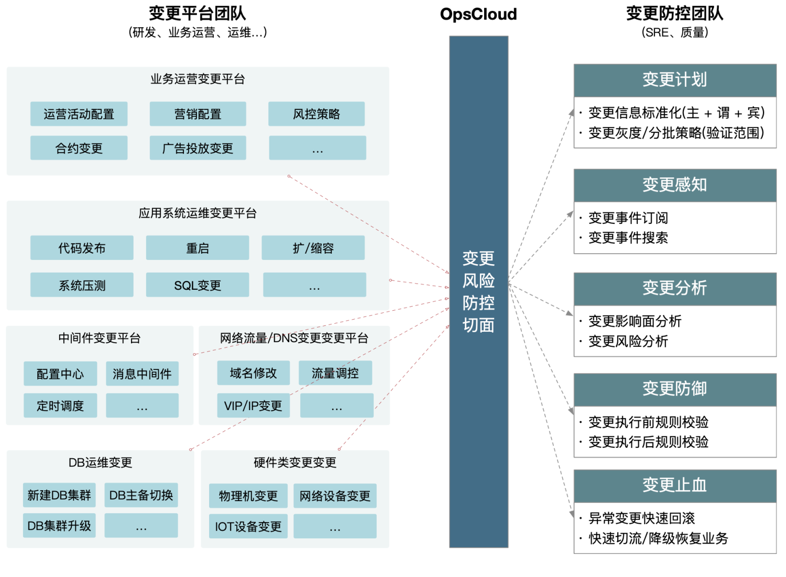

联通软件研究院，bilibili，蚂蚁集团的从事变更相关的同学在杭州首次线下的MeetUp，本次线下交流的都是在SRE领域有着丰富经验的同学，都在各自的公司参与了SRE关键工作和平台的建设，大家对于SRE如何做好变更的风险防控，以及中间可能会遇到的问题进行了讨论和交流，下面整理了一些讨论交流的内容，分享给大家。

<!-- truncate -->

> 本次是AlterShield开源后的第一次线下交流MeetUp，刚好有几位小伙伴对变更管控有兴趣，同时也在杭州，故一拍即合组了一个线下关于变更管控的技术讨论交流。  
地点：杭州·市民中心附近星巴克  
时间：2023.06.18  
本次MeetUp参与人(照片左至右)：

+ 吴天昊（联通软件研究院 副总架构师)
+ 邵创创（联通软件研究院 变更管理负责人）
+ 刘昊（Bilibili SRE体系&平台工程负责人）
+ 王月凡（蚂蚁集团 AiOps&变更管控负责人）
+ 袁帅（Bilibili 运维数据资产负责人）

## 1. 变更管控的重要性
线下交流的时候，大家都非常认可对于一个技术企业稳定性来说，变更管控是非常关键且重要的一件事情，在变更引发的故障上，都有相同的惨痛经历，同时变更又是一家技术公司往前演进的步伐，不能纯靠一些流程管控的手段，去加重变更的负担和周期，需要依靠一些技术手段，对变更风险进行有效的防控与处置，能够统一从SRE的角度，合理有效的去控制不同业务场景，可能引发的变更风险，同时对不同的业务场景，配置上通用的、定制化的防御防线，在变更期间去阻断变更引发的风险。

让**变更做到三板斧：可灰度、可观测、可回滚**，是能够防控变更风险的的关键思路，也是变更管控平台技术体系的基础支撑，**让变更执行能够灰度分批的生效，同时系统自动盯盘，进行前后置校验，当算法识别到风险后，阻断变更的执行，有效防止风险扩大**。

## 2. 关于如何快速进行变更管控的接入？

公司里面都有无数的变更执行平台，无论是负责服务器发布、运维的平台，还是底层网络、基础设施的变更平台，还是业务上的运营配置变更的平台，这些变更执行平台，都需要进行改造，接入到变更管控的标准体系内，但是在公司内部，这些变更平台负责人，本身是少有稳定性目标的，同时在故障真正发生之前，不太会重视变更可能会引发的稳定性风险，理所当然在变更管控接入改造配合度上，意愿度也不会特别强。

关于如何快速推进变更管控的接入，大致上有**三个思路**：

**1. 先从故障/风险较高的平台入手，以全站通用防控能力作为切入，如封网、窗口等，从而快速达到管控效果**  

**2. 及时借力故障发生时，故障往往发生后，风险意识、整改动力是比较强的** 

**3. 不断的宣贯变更的风险及其重要性。** 

除上述方式外，还是得持续探索底层无须改造接入的变更防控方案，比如从流量网关层、SQL执行层等。

## 3. 如何衡量变更风险防控的效果
前期可以通过**变更防御有效识别和拦截的风险数据**，去衡量变更风险防控带来的效果，这个前提是需要提前做好变更影响面分析、变更防御能力，能够针对每一笔变更，分析出有效的影响面，包括不限于影响的上下游系统、业务链路等，以及应该观测的监控指标，同时在结合变更防御自动的算法异常检测，能够实时的在变更期间识别指标异动、日志异常，有效的阻断变更风险。

## 4. 系统自动防御盯盘 VS 人工盯盘
在变更执行期间去往往需要运维同学人工进行盯盘，观察监控、观察日志，而人工观察天然会存在遗漏，并且人的精力是无法同时观察成百上千个系统指标，更何况往微服务分布式方向演进，一个系统的变更，往往涉及到上下游众多链路，仅靠人工是无法去完整观测齐全的，同时人工的观测非常依赖历史经验积累，往往不同经验的人工进行盯盘，效果差异都会比较大。
依赖系统进行自动的防御盯盘，就如同自动驾驶技术的视觉感知系统一样，**系统对于指标进行实时的算法异常检测，高效的同时对成百上千的系统指标、业务指标进行全自动的监控指标盯盘，快速有效的识别指标异动，同时在结合上变更管控的能力，能够有效的阻断、防控变更风险，防止变更风险逐步扩大**。

## 5. 为什么一定要变更管控与变更执行平台分离？
更专业的人，做更专业的事情，往往变更执行平台，考虑的问题是如果设计变更流程，尽可能快速执行完成，尽快自动化，但变更对于稳定性的影响，这个是一个持续性的防控问题，不会在变更平台设计之初，就完全解决掉，而SRE往往是对稳定性最终负责的人，所以是很有必要将变更管控单独提炼出来，这部分的持续演进和设计理念，主要都是围绕如何让SRE更加灵活、高效的防控风险故障去设计的，所以对应变更管控平台的开放性要求会高一些。

最终在**变更管控平台设计的思路上，会选择以切面的方式，将两部分平台职责划分开，让更专业的人，更专注的去做风险防控的事情，同时也便于做整个公司级统一的封网、窗口、规范性的管控和要求**。 

如下图所示：

本次交流了不少最近大家行业里面的趣事、八卦，还有对于整个SRE领域发展的看法和期待，整个过程非常的轻松自在，也非常期待后续有更多有想交流讨论的同学，再组一次分享与交流（不限聊技术~hahaha）

⭐️⭐️看这里⭐️⭐️欢迎微信扫码进交流群，期待与您的下一次MeetUp！

预约参加下一次MeetUp加微信：yvan_wyf

