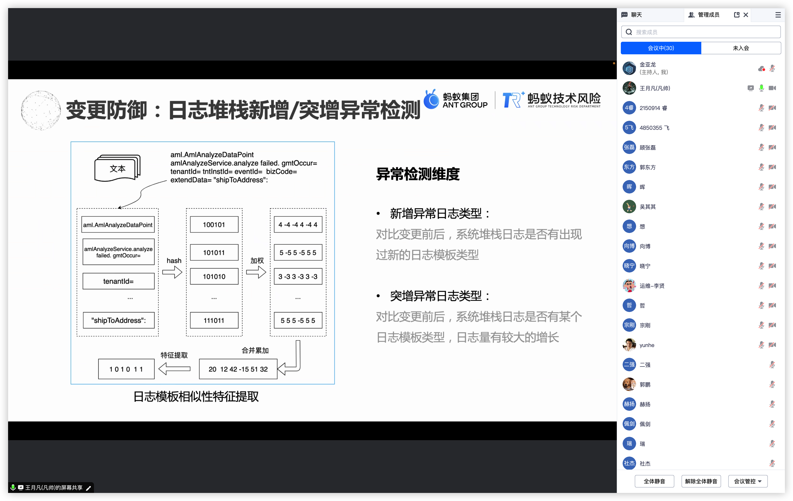
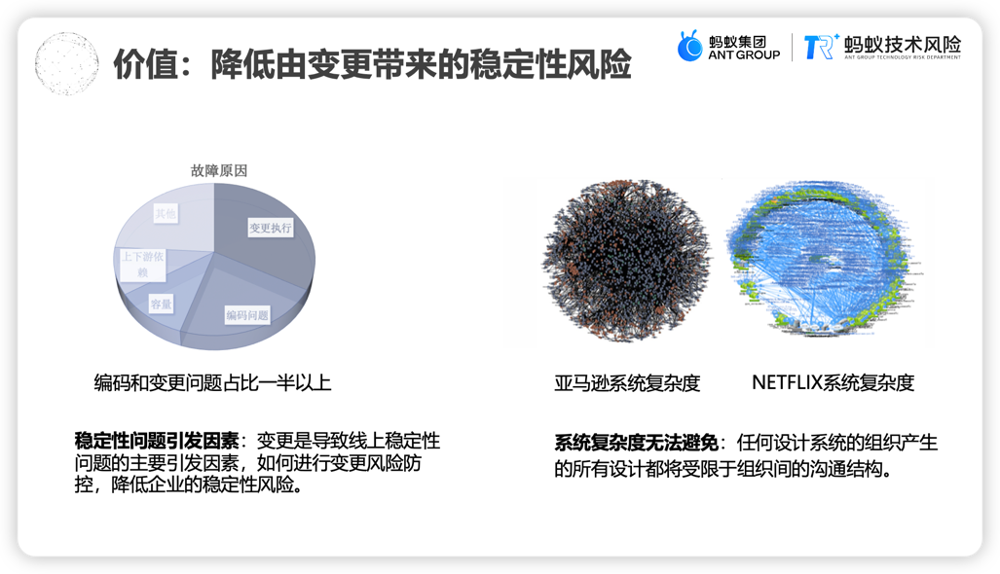
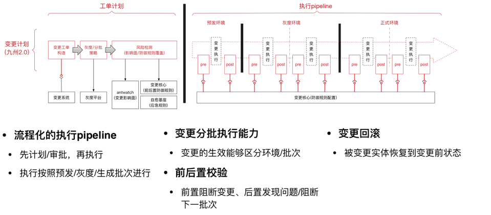
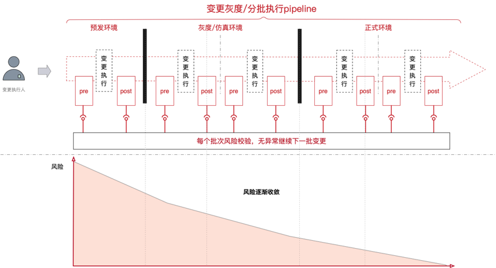
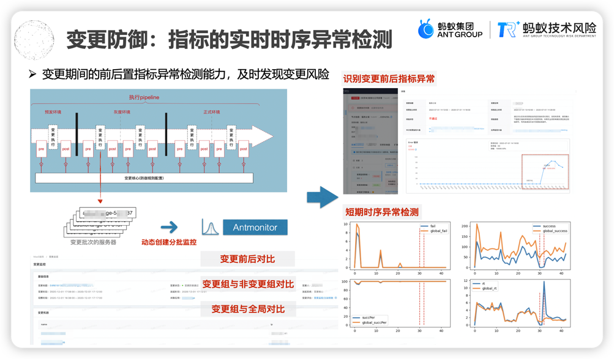
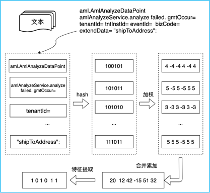

在第一次[线下MeetUp]举行之后，发现大家对于变更管控技术的兴趣还是比较浓厚的。同时有几个公司的小伙伴找到我们，希望再组织一次这样的交流。
于是我们在**7月10日 14:00-16:00**通过线上腾讯会议的方式再一次组织起从事SRE相关工作的一些同学参与到一起来讨论。在整个交流过程中，大家问到的一些
问题都是曾经变更管控在蚂蚁集团落地变更管控遇到的一些困难和问题，在这里整理分享给大家。

<!-- truncate -->

> 本次腾讯会议参加的同学主要有来自蚂蚁集团、美团、OPPO、作业帮的同学
> 会议峰值人数达到30人
> 

**本次线上MeetUp进程主要如下：**

1、王月凡同学分享了关于变更防控三个主要的点：
+ 变更防控的价值
+ 变更防控的方法和架构
+ 变更防控的实践

在分享完之后大家展开了比较激烈的讨论，线上提问超**30个**，这里整理一些比较有代表性的问题同大家分享交流。

## 1、变更防控的价值

当前互联网、科技技术公司面临的变更风险挑战：
1. 相互交错的组织协同模式
2. 错综复杂的分布式微服务链路
3. 对于稳定性问题的容忍度

如何应对公司错综复杂的变更操作，做好变更防控，降低变更引入的稳定性风险，主要聚焦变更技术架构、标准与规范、以及智能化技术的应用，通过技术的手段保障变更效率的同时，降低变更风险。
如何从公司视角，保持大家的步调一致，从而避免不必要的风险。这些问题都是典型的行业难题，这也是变更管控的价值所在。

更多信息获取见：[AlterShield v0.1正式开源]

## 2、变更防控方法与架构

要把变更防控起来，最重要的第一件事就是先定义清楚什么是变更，我们对变更的广泛定义是：***"企业内部人员触发的任何导致IT服务状态发生变化的行为"***

同时我们定义了一套标准的开放式变更管控协议**[OCMS]**，该协议已经在蚂蚁集团内部接入了上千种变更场景，并且有效拦截了数百次可能引发故障的变更风险。

但是接入变更管控并不意味着能够完全消除变更带来的风险，而是有更多技术性手段可以降低风险。

我们提出了**变更的三板斧**：可灰度（避免一次性梭哈变更）、可观测（变更过程中有可观测的指标、监控...）、可应急（变更出现问题有快速回滚的能力）

通过对变更灰度分批次执行与管控，每个批次的执行都需要回答以下三个问题：
1. 能不能做？ 
2. 做没做完？ 
3. 做没做对？ 

总的来说，通过对变更的灰度、分批次执行，并在每一个批次都进行前后置的风险校验，理论上来说一次变更的风险是逐渐被收敛的，一次变更的风险变化趋势图如下：

## 3、变更防控智能化实践

随着业务的快速发展，各种业务系统都在走向平台化，运维方式在经历人肉运维，脚本自动化运维后最终演变成**DevOps**。但随着大数据及人工智能的快速发展，传统的运维方式及解决方案已不能满足需求。
基于如何提升平台效率和稳定性及降低资源，关于蚂蚁集团内部一些**AIOps**的实践及实现分享给大家。

### case 1：指标的实时时序异常检测

这里实现的思路主要是结合监控平台对不同分组的机器的各种指标的时序序列使用一些智能化算法进行异常检测。 这里对一次变更的机器定义了如下组别：
+ 变更组：一个应用正在变更批次机器的时序
+ 历史组：该应用的同一个变更动作的同一个指标的历史时序
+ 背景组：该应用变更批次机器较长时间窗口内的时序
+ 对照组：该应用尚未发生变更批次机器的同时刻的时序
+ 日志组：该应用正在变更批次机器的 common error 日志信息

实践发现，如果不进行降噪，通常会有较大的噪声导致拦截率较高，影响业务。因此降噪也是很重要的一部分，主要的降噪维度有：
+ 时间角度
+ 变更对象
+ 变更范围
+ 历史相似度

相关算法技术：
+ DTW（ Dynamic Time Warping ，动态时间规划)
+ 3-Sigma
+ KDE(Kernel Density Estimation，核密度函数估计) 

### case2：日志堆栈新增/突增异常检测 

异常检测维度:
+ 新增异常日志类型： 对比变更前后，系统堆栈日志是否有出现过新的日志模板类型
+ 突增异常日志类型： 对比变更前后，系统堆栈日志是否有某个日志模板类型，日志量有较大的增长

_ps:关于更多智能化变更异常检测算法，近期将在[AlterShield官网]进行开源_

## MeetUp问题讨论 整理

这里整理了一些比较好的问题，关于大家更多的问题咨询见：[MeetUp回放]

**1、变更管控的效果和价值评价？**

主要是靠防御有效拦截率来证明，有效性主要通过看业务是否有真实的回滚，以及对业务是否有影响。

**2、变更前后置涉及到的交互会影响一大片变更平台，作为中心化系统的鲁棒性设计。**

SDK中要考虑这种容错性设计，首先对于管控系统的技术要求会较高，其次SDK中通过心跳机制实时的检测管控端是否出现问题，当出现问题时执行一些降级策略，确保变更平台不会因为管控平台的故障导致连带的故障。

**3、是否一定要按照[OCMS]协议，不同场景填写信息不太一样？**

[OCMS]协议是我们基于蚂蚁集团内部五年落地变更管控的经验，总结提炼的一套普适性较强的变更信息模型，对于不同场景填写的信息是不完全一样的。这套协议是可以根据自己的业务场景进行调整修改的～

**4、接入变更管控就能完全避免变更的风险吗？**

能很大程度上降低变更所引入的风险，变更的执行和管控分离是一种降低变更风险的思路，通过灰度、分批校验等技术手段尽可能的暴露出一次变更的风险并收敛。
同时当真的出现变更引起的问题时，具备有效的手段快速的建设能力（防御规则）避免下次同类问题的再次出现。

**5、关于智能分析的一些疑问？**

变更智能分析是下沉到代码维度的分析，程序分析本身就是一个比较有技术深度的问题，在蚂蚁集团内部是有独立的团队研究，此部分内容后续将通过一些文章简单介绍～

## 加入我们
开源项目官网：[AlterShield官网], [Github仓库地址]

欢迎大家加入AlterShield开源项目群参与讨论：

 
[AlterShield v0.1正式开源]:https://altershield.io/zh-CN/blog/welcome-altershield-v0.1/
[OCMS]:https://altershield.io/zh-CN/docs/open-change-management-specification/overview
[线下MeetUp]:https://altershield.io/zh-CN/blog/meetup-0618/
[AlterShield官网]:https://altershield.io
[MeetUp回放]:https://altershield.yuque.com/org-wiki-altershield-gug9gu/lg0rts/clg87wxx0gbypfg4
[Github仓库地址]:https://github.com/traas-stack/altershield
