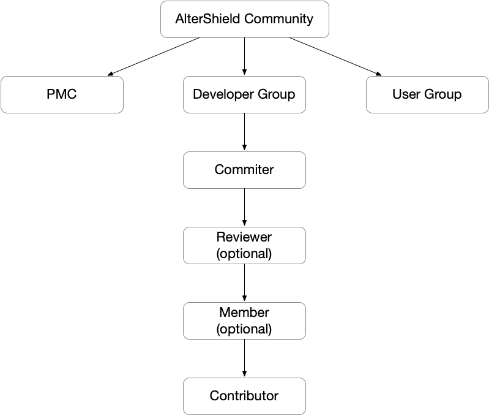

# 社区
您好，欢迎来到 AlterShield 开源社区，首先感谢您对 AlterShield 的关注 ❤
社区目前仍处于初期阶段，诚邀您进行各类的讨论和指正。无论是错别字修正、文档翻译、Bug 修复、变更故障案例讨论、增加新功能，欢迎提 issue 或 pull request 至 Github 社区，也可以加入钉钉群：11360043976 联系我们。
项目地址：
- AlterShield：https://github.com/traas-stack/altershield
- AlterShield-Operator：https://github.com/traas-stack/altershield-operator

## 提问指南

当您阅读 AlterShield 相关的文档、博客、源码时遇到困难，欢迎社区所有同学通过 Github Issue 区提交反馈。您可以在 Issue 里写下您的问题、脱敏后的变更故障案例或任何您对 AlterShield 的疑惑。发 Issue 可以方便后人，后人遇到问题时通过搜索引擎就能搜到解决方案。
如果 issue 回复不及时，可以去钉钉群里找群管理员，群管理员会帮忙催项目维护者回复 issue。

## 参与开源共建

作为开源社区，我们欢迎各种形式的贡献，您可以参与到社区的共建的形式包括但不限于：
+ 错别字修正：帮助我们指正文档中的错误。
+ 问题及案例探讨：您公司中的变更故障案例，脱敏后可参与讨论，一期探讨解决方案。
+ Bug提交：帮助我们指出 AlterShield 中逻辑错误的地方。
+ 新功能场景探讨：任何 AlterShield 还不具备的变更领域功能，都可以一起讨论。
+ 完善 OCMS 协议：目前 OCMS 开源还处于0.1版本，如果在您的场景下有不能适配的情况，您可以直接参与讨论及扩充。
+ 完善 Operator 生态：目前 Operator 在0.1版本会对接Kubernetes Deployment，您可以在您的CI/CD工具下改造及对接 Operator，扩展其生态。
+ 对接更多监控工具：您可以将您所使用的监控工具对接到 AlterShield 提供的可观测性防御能力中，扩展 AlterShield 的检测能力范围。
+ 沉淀您的变更防御专家经验：您可以以Plugin、SPI扩展的形式，将您的变更防御专家经验沉淀到 AlterShield 中。

## AlterShield 社区组织架构

### Developer Group（代码/文档）
#### Contributor

**如何成为 Contributor：**

在 AlterShield 的任何一个项目中成功提交一个 PR 并合并。

#### Member

加入 AlterShield GitHub 组织，成为 AlterShield 开源社区的一员。

##### 成为 Member 的条件

满足以下条件可以申请成为 Member:
+ 贡献过一个有价值的 PR
+ 有意愿一起维护社区

##### 如何申请成为 Member ?

可以在 AlterShield任一社区 发个 issue，包括：
+ 做个自我介绍
+ 贴一下自己贡献过的 PR

社区维护者会即时回复您。

##### 职责

Member 需要一起帮忙回复 issue/pr，triage（把 issue 分配给对应模块的负责人）

##### 权限

Triage 权限。有权限操作 issue 和 pr，例如打 label、分配问题。

详细的权限说明见 [permissions-for-each-role][permissions-for-each-role]

[permissions-for-each-role]:https://docs.github.com/en/organizations/managing-user-access-to-your-organizations-repositories/repository-roles-for-an-organization#permissions-for-each-role

#### Reviewer （可选）

模块负责人，负责某个模块的 issue review 和 code review
该角色可选，各位项目负责人如果觉得没必要可以不设置该角色。

##### 成为 Reviewer 的条件

有意愿负责某个模块的 issue review 和 code review，且对该模块贡献过的 PR 满足下列条件之一:
- 1 个 Hard 级别的 PR
- 2 个 Medium 级别的 PR
- 1 个 Medium+2 个 Easy 级别的 PR

注：相当于Hard:Medium:Easy的换算关系是1:2:4

设计这个规则的逻辑是： Reviewer 要对某个模块很懂，才能对这个模块把关。那怎么判断他很懂呢？可以看他做过的 PR，1 个 hard 级别的 pr，或者 2 个 medium 级别的 pr，或者 1 个 medium+2 个 easy 级别的 pr

##### Reviewer 的职责

负责某个模块的 issue review 和 code review,给出技术建议。有该模块相关的重大变更会 request review 模块 Reviewer。

#### Committer

##### 如何成为 Committer ?

贡献过的 PR 满足下列条件:

- 合并的 PR 达到 10 个；
- 其中至少包含 1 个 Hard 级别 PR, 或者 4 个 Medium 级别 PR；

##### 职责
- 社区咨询支持；
- 积极响应指派给您的 Issue 或 PR；
- 对于社区重大决定的投票权；
- Review 社区的 PR；

##### 权限
- Pull Request review 权限；
- Pull Request approve 权限；

##### 认证、运营宣传
- 在 Discussion 区颁发电子证书

### PMC

项目管理委员会，为项目核心管理团队，参与 roadmap 制定与社区相关的重大决议；

#### 如何成为 PMC ?

由项目的 PMC Member 为某位 Committer 提名，然后 PMC 投票，投票过半即可晋升为 PMC Member

#### 职责
- 积极参与社区讨论，对社区重大决策给予指导；
- 负责保证开源项目的社区活动都能运转良好；

#### 权限
- Pull Request review 权限；
- Pull Request approve 权限；
- Merge 权限；