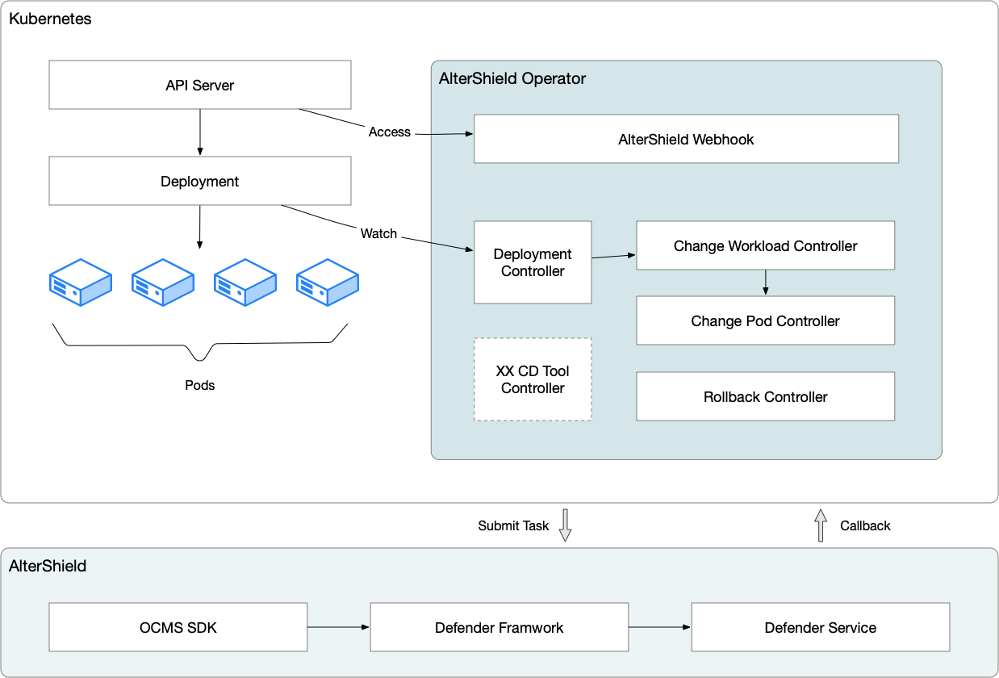

# AlterShield Operator是什么
## 简介
AlterShield Operator是一款基于Operator-SKD开发的Kubernetes Operator，旨在通过对Workload资源的管控，提高Kubernetes集群的稳定性和可靠性。目前，AlterShield Operator支持对Deployment资源进行管控，而其他通用资源正在不断开发中。其核心设计目标是开发迅速、学习简单、易于扩展。

## 功能
AlterShield Operator具有以下主要功能：

1. 准入控制，对Workload资源的部署进行管控，防止异常状态下的资源部署

2. 运行检测，对Workload资源下的POD进行监测，确保资源的运行状态

3. 回滚自愈，对Workload资源的异常状态进行自动回滚，自愈回滚异常的发布

通过这些功能，AlterShield Operator可以帮助用户更好地管理Kubernetes集群中的Workload资源，提高系统的稳定性和可靠性。


## 源码目录结构
AlterShield Operator 的源码目录结构如下：
```
./apis/
./bin/
./certs/
./config/
./controllers/
./routers/
./main.go
./Makefile
````
- `apis/`：存放自定义CRD（Custom Resource Definition）的API以及与Kubernetes原生API相关的结构体定义。
- `bin/`：存放AlterShield Operator的可执行文件。
- `certs/`：存放AlterShield Operator的证书文件，用于本地调试Webhook。
- `config/`：存放AlterShield Operator的配置文件。
- `controllers/`：存放AlterShield Operator的控制器代码。
- `routers/`：存放AlterShield Operator与AlterShield Server之间通信的路由代码。
- `runnable/`：存放AlterShield Operator的后台任务代码。
- `main.go`：AlterShield Operator 的入口文件。
- `Makefile`：AlterShield Operator 的编译文件。
## 架构设计
### 1. 设计目标
AlterShield Operator 作为一个 Kubernetes Operator，其主要功能是通过监听 Kubernetes 中的 CRD，并通过与 AlterShield Server 之间的通信，来实现对 Workload 的管控。具体来说，AlterShield Operator 的设计目标如下：
#### 1.1. 版本确认与发板控制
- 通过 Webhook 的方式，对 Kubernetes 中的 Workload 进行版本确认与发板控制。当用户提交新的 Workload 版本时，AlterShield Operator 会通过 Webhook 发送请求，与 AlterShield Server 进行版本确认和发板控制，以确保用户提交的版本符合安全规范，并且可以正确部署到 Kubernetes 集群中。
#### 1.2. 实时监控
- 通过 Watch 的方式，对 Kubernetes 中的 Workload 与 Pod 进行实时监控。当 Kubernetes 中的 Workload 或 Pod 发生变化时，AlterShield Operator 会及时检测并处理，以确保 Kubernetes 集群中的 Workload 和 Pod 状态与 AlterShield Server 保持同步。
#### 1.3. 发布状态汇总
- 通过维护 ChangeWorkload，来实现汇总 Kubernetes 中的 Workload 的发布状态。当用户提交新的 Workload 版本时，AlterShield Operator 会将其状态记录到 ChangeWorkload 中，并且定期向 AlterShield Server 发送请求，以更新 Workload 的发布状态。这样一来，用户可以方便地查看 Workload 的发布状态和变化历史。
#### 1.4. 发布状态校验
- 通过维护 ChangePod 并与 AlterShield Server 之间的通信，来实现对 Kubernetes 中的 Pod 的发布状态的校验。当 Kubernetes 中的 Pod 发生变化时，AlterShield Operator 会检测其状态，并通过与 AlterShield Server 的通信，来验证其发布状态是否正确。
#### 1.5. 配置更新
- 通过变更 OpsConfigInfo，来实现 Operator 的配置更新。当用户需要修改 AlterShield Operator 的配置时，可以通过修改 OpsConfigInfo 中的参数来实现。AlterShield Operator 会及时检测到参数的变化，并相应地更新其配置，以达到用户设定的效果。
### 2. 系统组件
AlterShield Operator 由以下几个部分组成：
- Controller：负责监听 Kubernetes 中的 CR与自定义的 CRD，并进行相应的处理。
- Webhook：负责对 Kubernetes 中的 Workload 进行版本确认与发板控制。
- Router：负责与 AlterShield Server 之间的回调处理。
- Runnable：负责后台任务异步。
### 3. 运行流程
AlterShield Operator 系统架构图如下：



- 1. Webhook 监听 Kubernetes 中的 Deployment，如果 Deployment 的 Template 发生变更，更新 Deployment 的 Version Label，并判断是否阻断发布。Version Label 是一个用于标记 Deployment 版本的 Label，每当 Deployment 的 Template 发生变更时，Version Label 的值也会随之更新，这个 Label 用于帮助 AlterShield Operator 进行版本控制和管理。
- 2. Deployment Controller 监听 Kubernetes 中的 Deployment，并创建对应版本的 ChangeWorkload。ChangeWorkload 是 AlterShield Operator 中的一个自定义资源类型，用于记录 Deployment 的版本变更历史。当 Deployment 的 Template 发生变更时，Deployment Controller 会创建一个新的 ChangeWorkload，用于记录新版本的 Deployment 信息。
- 3. Pod Controller 监听 Kubernetes 中的 Pod，并判断当前是否为已完成发布的 Pod，如果是，则添加 Finished Label。Finished Label 是一个用于标记已完成发布的 Pod 的 Label，可以帮助 AlterShield Operator 定位已完成发布的 Pod，并计算已完成发布的 Pod 数量。
- 4. ChangeWorkload Controller 监听 Kubernetes 中的 ChangeWorkload 和已完成发布的 Pod，当 Finished Pod 达到阈值时，创建 Init 状态的 ChangePod。ChangePod 是 AlterShield Operator 中的另一个自定义资源类型，用于记录发布的 Pod 的状态和回调结果。当已完成发布的 Pod 数量达到阈值时，ChangeWorkload Controller 会创建一个 Init 状态的 ChangePod，将来会把Pod信息传递给 AlterShield Server。
- 5. ChangePod Controller 监听 Kubernetes 中的 ChangePod，当 ChangePod 的状态为 Init 时，挑选不超过阈值个数的 Finished Pod，并将信息传递给 AlterShield Server，通过 Router 和 CallBack Handle 实现回调功能。ChangePod Controller 会监听 AlterShield Server 的回调结果，并根据回调结果更新 ChangePod 的状态。
- 6. ChangePod Controller 监听 Kubernetes 中的 ChangePod，当 ChangePod 的状态为 Callback Finished 时，根据回调结果更新 ChangePod 的状态，并将 ChangePod 的状态更新为 Done。并将该信息发送给 ChangeWorkload Controller。
- 7. ChangeWorkload Controller 监听 Kubernetes 中的 ChangeWorkload 和 Done ChangePod，根据 ChangePod 的状态更新 ChangeWorkload 的状态，判断是否阻断发布。如果所有的 ChangePod 中Pod的状态均通过校验，ChangeWorkload Controller 将会将 ChangeWorkload 的状态更新为 Success，否则将更新为 Suspend。
- 8. Rollback Runnable 检查 Kubernetes 中的 Pod，如果发现 Pod 长时间（默认2分钟）未达到 Running 状态，则触发 Rollback 机制。Rollback Runnable 是 AlterShield Operator 中一个用于检查 Pod 状态的后台任务，如果发现 Pod 长时间处于非 Running 状态，则会触发自动回滚操作，确保 Kubernetes 集群的稳定性。
- 9. Rollback Runnable 监听 Kubernetes 中的 ChangeWorkload，当 ChangeWorkload 的状态为 Rollback 时，触发 Rollback 机制。Rollback Runnable 还会监听 ChangeWorkload 的状态，如果发现 ChangeWorkload 的状态为 Rollback，则会触发自动回滚操作，确保 Kubernetes 集群的稳定性。（建设中）
